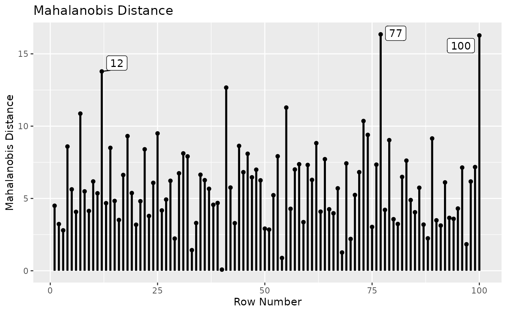
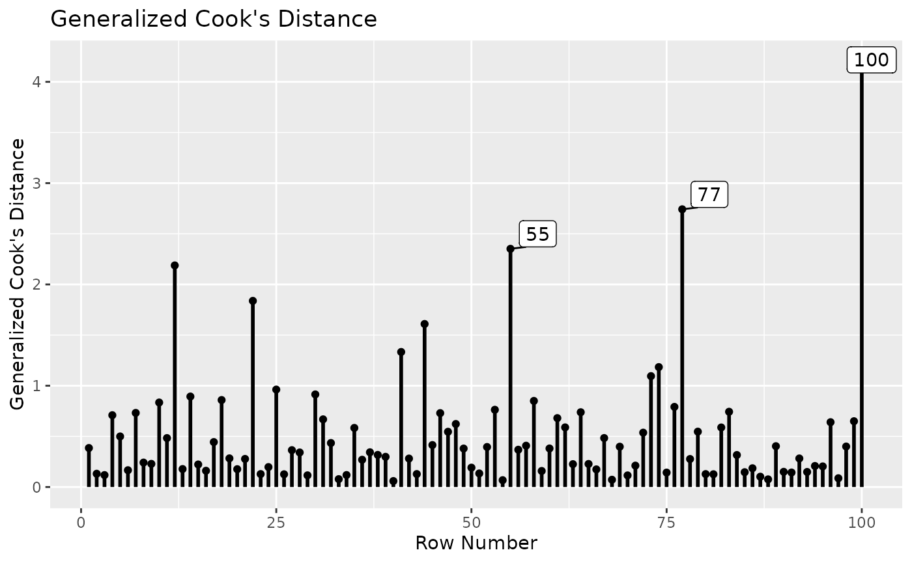
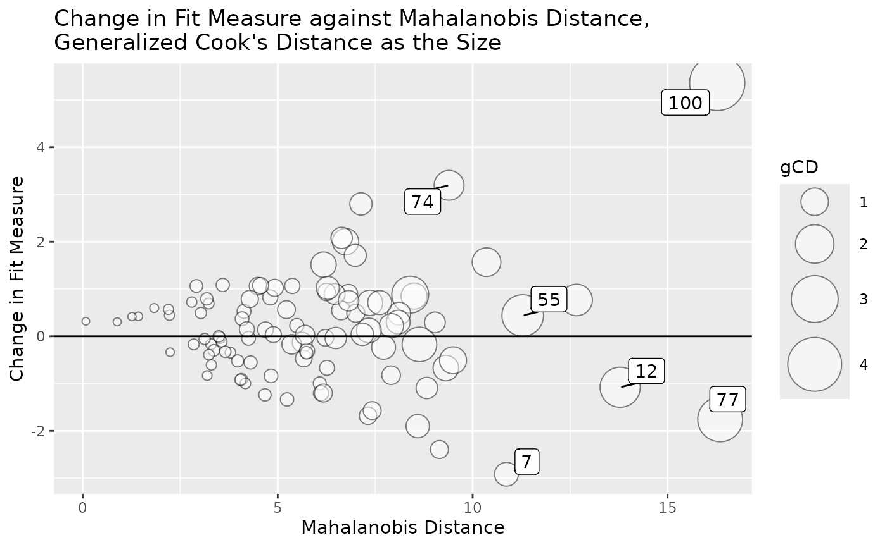
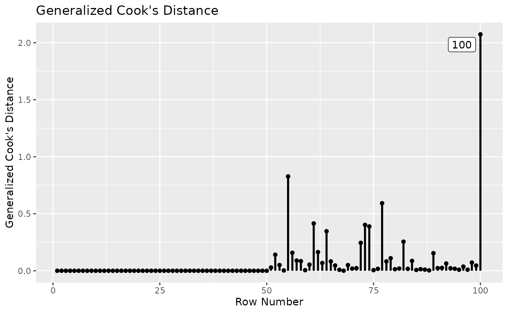
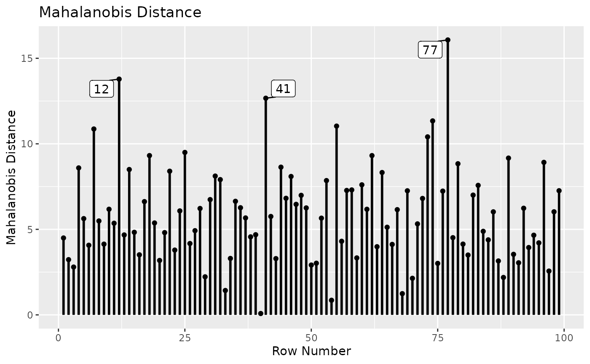
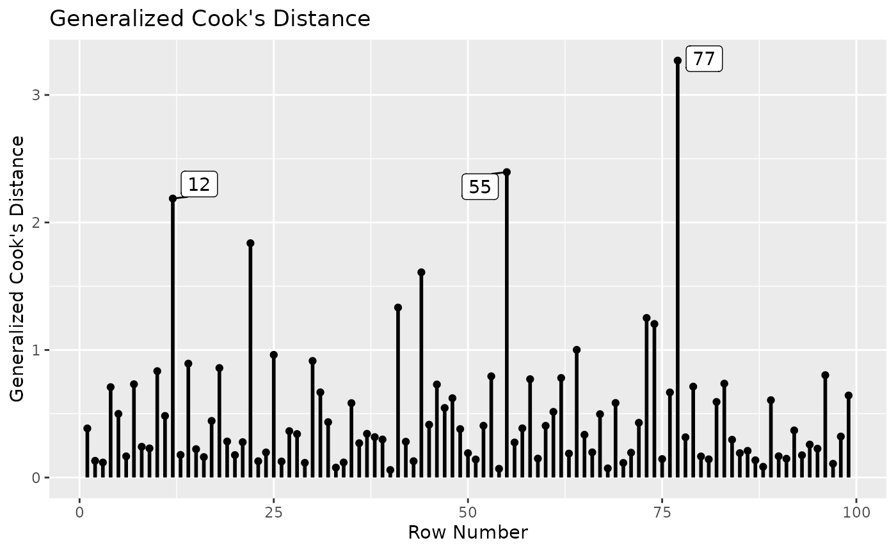
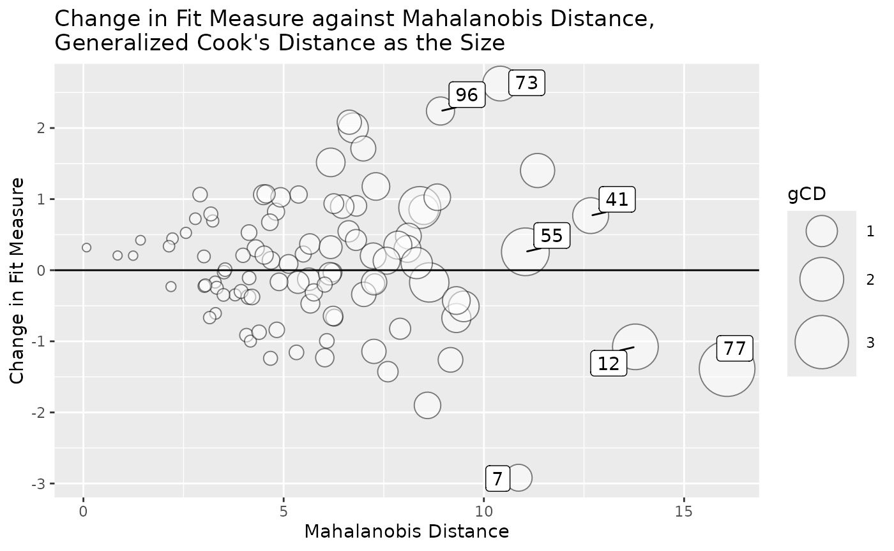

# Sensitivity Analysis in Multiple-Group Models

## Goal

This article illustrates how to identify influential cases in a
multiple-group model using the
[`semfindr`](https://sfcheung.github.io/semfindr/) package
(**cheung_semfindr_2026?**). This article assumes that readers have
learned how to use the main functions for single-group models (See
[`vignette("semfindr", package = "semfindr")`](https://sfcheung.github.io/semfindr/articles/semfindr.md)).

## Dataset and Models

The sample dataset `cfa_dat_mg` in `semfindr` will be used in this
illustration:

``` r
library(semfindr)
data(cfa_dat_mg)
head(cfa_dat_mg)
```

    ##           x1          x2         x3         x4          x5         x6     gp
    ## 1 -1.2690938 -1.32550591 -0.6285011 -0.7215738 -2.81187575 -0.8436144 GroupA
    ## 2 -0.0304962  0.05275281  1.1867437 -0.5193213 -1.92131327 -0.1802093 GroupA
    ## 3 -1.0134542 -0.05071220 -0.7482927 -1.0483134  0.98383479 -0.1672748 GroupA
    ## 4  0.1647769 -1.75609084 -1.6568902 -0.8036030 -2.14339421 -0.5066695 GroupA
    ## 5  1.9583190  2.25384865  0.4972562  1.3103522  0.36280304  0.9186370 GroupA
    ## 6 -1.2487913 -1.48482257 -0.7739649  0.8942307 -0.03870106  0.0403398 GroupA

``` r
table(cfa_dat_mg$gp)
```

    ## 
    ## GroupA GroupB 
    ##     50     50

The dataset has six variables, `x1` to `x6`. The variable `gp` denotes
the group of a case, with values `"GroupA"` and `"GroupB"`. Each group
has 50 cases and the total number of cases is 100.

We use assessing measurement invariance as the scenario, based on the
[tutorial](https://lavaan.ugent.be/tutorial/groups.html) on
multiple-group models at the official website of lavaan.

Three confirmatory factor analytic (CFA) models are to be fitted. They
are all defined by the following model syntax:

``` r
mod <-
"
f1 =~ x1 + x2 + x3
f2 =~ x4 + x5 + x6
"
```

The first model has no between-group constraints. It tests configural
invariance.

``` r
library(lavaan)
```

    ## This is lavaan 0.6-21
    ## lavaan is FREE software! Please report any bugs.

``` r
fit_config <- cfa(mod, cfa_dat_mg,
                  group = "gp")
```

The second model tests weak invariance, with factor loadings constrained
to be equal across groups:

``` r
fit_weak <- cfa(mod, cfa_dat_mg,
                group = "gp",
                group.equal = "loadings")
```

The third model tests strong invariance, with factor loadings and item
intercepts constrained to be equal across groups:

``` r
fit_strong <- cfa(mod, cfa_dat_mg,
                  group = "gp",
                  group.equal = c("loadings", "intercepts"))
```

The three models are compared by
[`lavaan::lavTestLRT()`](https://rdrr.io/pkg/lavaan/man/lavTestLRT.html):

``` r
lavTestLRT(fit_config, fit_weak, fit_strong)
```

    ## 
    ## Chi-Squared Difference Test
    ## 
    ##            Df    AIC    BIC  Chisq Chisq diff RMSEA Df diff Pr(>Chisq)
    ## fit_config 16 1878.3 1977.3 30.454                                    
    ## fit_weak   20 1871.7 1960.3 31.904      1.450     0       4     0.8355
    ## fit_strong 24 1866.2 1944.3 34.357      2.453     0       4     0.6531

``` r
lavTestLRT(fit_config, fit_strong)
```

    ## 
    ## Chi-Squared Difference Test
    ## 
    ##            Df    AIC    BIC  Chisq Chisq diff RMSEA Df diff Pr(>Chisq)
    ## fit_config 16 1878.3 1977.3 30.454                                    
    ## fit_strong 24 1866.2 1944.3 34.357      3.903     0       8     0.8658

The tests do not reject both strong invariance and weak invariance.

These are the fit measures of the three models:

``` r
fm <- c("chisq", "pvalue", "cfi", "tli", "rmsea")
round(data.frame(configural = fitMeasures(fit_config, fm),
                 weak = fitMeasures(fit_weak, fm),
                 strong = fitMeasures(fit_strong, fm)), 3)
```

    ##        configural   weak strong
    ## chisq      30.454 31.904 34.357
    ## pvalue      0.016  0.044  0.079
    ## cfi         0.867  0.891  0.905
    ## tli         0.751  0.836  0.881
    ## rmsea       0.134  0.109  0.093

Although strong invariance is not rejected, the configural invariance
and weak invariance model do not have satisfactory fit. Interestingly,
the most restrictive model, the strong invariance model, has the best
fit. The model chi-square is not significant.

## Influential Cases

Despite the fit measures, it is still a good practice to check whether
there are any influential cases. Let’s start with the configural
invariance model.

### Configural Invariance Model

#### Leave-One-Out by `lavaan_rerun()`

The leave-one-out approach is used for illustration on the configural
invariance model, `fit_config`. For this simple model with only 100
cases, we do not have to use parallel processing. The model is fitted
100 times, each time with one case removed:

``` r
rerun_config <- lavaan_rerun(fit_config)
```

    ## The expected CPU time is 21.6 second(s).
    ## Could be faster if run in parallel.

Not shown here, but it is possible that a model may fail to converge or
have inadmissible solutions if removed. This is especially the case for
models with constraints. The function will report cases leading to
nonconvergence or inadmissible solutions. Influence measures will not be
computed for these cases.

#### All-In-One: `influence_stat()`

For preliminary assessment, we can just
[`influence_stat()`](https://sfcheung.github.io/semfindr/reference/influence_stat.md)
to compute all commonly used measures of case influence (Pek &
MacCallum, 2011), as well as Mahalanobis distance (Mahalanobis, 1936),
using the output of
[`lavaan_rerun()`](https://sfcheung.github.io/semfindr/reference/lavaan_rerun.md):

``` r
inf_config <- influence_stat(rerun_config)
```

The output can then be used for other functions to examine specific
aspects of case influence.

#### Mahalanobis Distance

Because the model is a CFA model and all observed variables are
endogenous, it is acceptable to examine Mahalanobis distance first (see
[`print.influence_stat()`](https://sfcheung.github.io/semfindr/reference/print.influence_stat.md)
on options available when printing the output of
[`influence_stat()`](https://sfcheung.github.io/semfindr/reference/influence_stat.md)).

For multiple-group models, Mahalanobis distance for a case is computed
using the mean and covariance matrix of the group this case belongs to.

``` r
print(inf_config,
      what = "mahalanobis",
      first = 5)
```

    ## 
    ## -- Mahalanobis Distance --
    ## 
    ##         md
    ## 77  16.349
    ## 100 16.275
    ## 12  13.784
    ## 41  12.666
    ## 55  11.285
    ## 
    ## Note:
    ## - Only the first 5 case(s) is/are displayed. Set 'first' to NULL to display all cases.
    ## - Cases sorted by Mahalanobis distance in decreasing order.

We can visualize the values using
[`md_plot()`](https://sfcheung.github.io/semfindr/reference/influence_plot.md)

``` r
md_plot(inf_config,
        largest_md = 3)
```



Cases 77 and 100 are high on Mahalanobis distance. However, the
differences from other cases are not substantially large.

#### Case Influence on Fit Measures

We then examine case influence on fit measures, sorted by model
chi-squares:

``` r
print(inf_config,
      what = "fit_measures",
      first = 5,
      sort_fit_measures_by = "chisq")
```

    ## 
    ## -- Case Influence on Fit Measures --
    ## 
    ##      chisq    cfi  rmsea    tli
    ## 100  5.359 -0.042  0.027 -0.080
    ## 74   3.193 -0.029  0.015 -0.054
    ## 7   -2.919  0.020 -0.014  0.038
    ## 96   2.800 -0.025  0.013 -0.047
    ## 89  -2.395  0.019 -0.011  0.036
    ## 
    ## Note:
    ## - Only the first 5 case(s) is/are displayed. Set 'first' to NULL to display all cases.
    ## - Cases sorted by chisq in decreasing order on absolute values.

Case 100 has a relatively large influence on model chi-square.

#### Case Influence on Parameter Estimates

Last, we assess casewise influence on parameter estimates by setting
`what` to `"parameters"`. When printed, by default, cases will be sorted
by generalized Cook’s distance (Cook, 1977):

``` r
print(inf_config,
      what = "parameters",
      first = 5)
```

    ## 
    ## -- Standardized Case Influence on Parameter Estimates --
    ## 
    ##     f1=~x2 f1=~x3 f2=~x5 f2=~x6 x1~~x1 x2~~x2 x3~~x3 x4~~x4 x5~~x5 x6~~x6
    ## 100  0.000  0.000  0.000  0.000  0.000  0.000  0.000  0.000  0.000  0.000
    ## 77   0.000  0.000  0.000  0.000  0.000  0.000  0.000  0.000  0.000  0.000
    ## 55   0.000  0.000  0.000  0.000  0.000  0.000  0.000  0.000  0.000  0.000
    ## 12  -0.124 -0.035 -0.365 -0.202 -0.011  0.010 -0.092 -0.231  1.230  0.191
    ## 22   0.479  0.501  0.005  0.410  0.352 -0.243 -0.247  0.449 -0.032 -0.591
    ##     f1~~f1 f2~~f2 f1~~f2  x1~1  x2~1  x3~1   x4~1   x5~1   x6~1 f1=~x2.g2
    ## 100  0.000  0.000  0.000 0.000 0.000 0.000  0.000  0.000  0.000    -0.742
    ## 77   0.000  0.000  0.000 0.000 0.000 0.000  0.000  0.000  0.000     0.365
    ## 55   0.000  0.000  0.000 0.000 0.000 0.000  0.000  0.000  0.000     0.618
    ## 12   0.073  0.150  0.063 0.188 0.042 0.098 -0.074  0.443 -0.116     0.000
    ## 22  -0.225 -0.148 -0.729 0.152 0.252 0.241 -0.280 -0.022 -0.098     0.000
    ##     f1=~x3.g2 f2=~x5.g2 f2=~x6.g2 x1~~x1.g2 x2~~x2.g2 x3~~x3.g2 x4~~x4.g2
    ## 100     0.432    -0.566     0.487    -0.231     0.706     0.526    -0.202
    ## 77     -0.432     0.061     0.248    -0.090     0.863     0.085     0.074
    ## 55      0.762     0.233     0.293     1.315    -0.028    -0.162     0.158
    ## 12      0.000     0.000     0.000     0.000     0.000     0.000     0.000
    ## 22      0.000     0.000     0.000     0.000     0.000     0.000     0.000
    ##     x5~~x5.g2 x6~~x6.g2 f1~~f1.g2 f2~~f2.g2 f1~~f2.g2 x1~1.g2 x2~1.g2 x3~1.g2
    ## 100     0.450     0.606     0.367     0.258     0.511   0.242  -0.053   0.527
    ## 77     -0.070    -0.047     0.532    -0.134     0.151   0.340   0.563   0.073
    ## 55     -0.083    -0.192    -0.781    -0.081    -0.345   0.198  -0.164  -0.159
    ## 12      0.000     0.000     0.000     0.000     0.000   0.000   0.000   0.000
    ## 22      0.000     0.000     0.000     0.000     0.000   0.000   0.000   0.000
    ##     x4~1.g2 x5~1.g2 x6~1.g2   gcd
    ## 100   0.196  -0.019   0.474 4.198
    ## 77    0.053   0.050   0.188 2.742
    ## 55   -0.176  -0.196  -0.134 2.351
    ## 12    0.000   0.000   0.000 2.188
    ## 22    0.000   0.000   0.000 1.838
    ## 
    ## Note:
    ## - Changes are standardized raw changes if a case is included.
    ## - Only the first 5 case(s) is/are displayed. Set 'first' to NULL to display all cases.
    ## - Cases sorted by generalized Cook's distance.

We can also visualize the generalized Cook’s distance using
[`gcd_plot()`](https://sfcheung.github.io/semfindr/reference/influence_plot.md):

``` r
gcd_plot(inf_config,
         largest_gcd = 3)
```



The generalized Cook’s distance suggests that Case 100 has a strong
influence on parameter estimates. It only affects parameter estimates in
`GroupB` because it is in `GroupB` and the model has no between-group
equality constraints.

We can visualize all three aspects in one plot using
[`gcd_gof_md_plot()`](https://sfcheung.github.io/semfindr/reference/influence_plot.md):

``` r
gcd_gof_md_plot(inf_config,
                fit_measure = "chisq",
                circle_size = 15,
                largest_gcd = 3,
                largest_md = 3,
                largest_fit_measure = 3)
```



Case 100 stands out from others when all three aspects are considered
together.

To assess case influence only on factor loadings in `GroupB` in this
model, we can use
[`est_change()`](https://sfcheung.github.io/semfindr/reference/est_change.md).
`"=~.GroupB"` denotes all factor loadings in `GroupB` (see
[`pars_id()`](https://sfcheung.github.io/semfindr/reference/pars_id.md)
on how to select parameters):

``` r
est_change_group <- est_change(rerun_config,
                               parameters = c("=~.GroupB"))
print(est_change_group,
      first = 5)
```

    ## 
    ## -- Standardized Case Influence on Parameter Estimates --
    ## 
    ##     f1=~x2.g2 f1=~x3.g2 f2=~x5.g2 f2=~x6.g2   gcd
    ## 100    -0.742     0.432    -0.566     0.487 2.074
    ## 55      0.618     0.762     0.233     0.293 0.828
    ## 77      0.365    -0.432     0.061     0.248 0.592
    ## 61      0.023    -0.263     0.099    -0.495 0.415
    ## 73     -0.412    -0.046    -0.441    -0.288 0.403
    ## 
    ## Note:
    ## - Changes are standardized raw changes if a case is included.
    ## - Only the first 5 case(s) is/are displayed. Set 'first' to NULL to display all cases.
    ## - Cases sorted by generalized Cook's distance.

The value of generalized Cook’s distance is smaller for Case 100 because
only the influence on factor loadings is computed. However, the
difference from those values of other cases is much larger. This can be
visualized using
[`gcd_plot()`](https://sfcheung.github.io/semfindr/reference/influence_plot.md):

``` r
gcd_plot(est_change_group)
```



#### Is Mahalanobis Distance Enough?

Note that the example above illustrates that a case that is extreme is
not necessarily a case that is influential. Case 100 is influential but
it is not the case with the highest Mahalanobis distance. Admittedly,
Mahalanobis distance does reflect the potential to be influential.
However, in some models, such as models with regression paths (e.g., a
path model), an influential case may not be an extreme case. Therefore,
it is not enough to examine only Mahalanobis distance.

### Weak Invariance Model and Strong Invariance Model

The above steps can be repeated for the other two models. They are not
shown here for brevity.

## Fit the Models Again Without The Potential Influential Case

Let us fit the three models again, without Case 100.

``` r
cfa_dat_mg_no100 <- cfa_dat_mg[-100, ]
fit_config_no100 <- cfa(mod, cfa_dat_mg_no100,
                        group = "gp")
fit_weak_no100 <- cfa(mod, cfa_dat_mg_no100,
                      group = "gp",
                      group.equal = "loadings")
fit_strong_no100 <- cfa(mod, cfa_dat_mg_no100,
                        group = "gp",
                        group.equal = c("loadings", "intercepts"))
```

``` r
lavTestLRT(fit_config_no100, fit_weak_no100, fit_strong_no100)
```

    ## 
    ## Chi-Squared Difference Test
    ## 
    ##                  Df    AIC    BIC  Chisq Chisq diff RMSEA Df diff Pr(>Chisq)
    ## fit_config_no100 16 1840.5 1939.1 25.095                                    
    ## fit_weak_no100   20 1834.0 1922.3 26.657     1.5616     0       4     0.8157
    ## fit_strong_no100 24 1828.4 1906.3 29.031     2.3739     0       4     0.6673

``` r
lavTestLRT(fit_config_no100, fit_strong_no100)
```

    ## 
    ## Chi-Squared Difference Test
    ## 
    ##                  Df    AIC    BIC  Chisq Chisq diff RMSEA Df diff Pr(>Chisq)
    ## fit_config_no100 16 1840.5 1939.1 25.095                                    
    ## fit_strong_no100 24 1828.4 1906.3 29.031     3.9355     0       8     0.8629

Strong invariance is still not rejected if Case 100 is removed.

``` r
fm <- c("chisq", "pvalue", "cfi", "tli", "rmsea")
round(data.frame(configural = fitMeasures(fit_config_no100, fm),
                 weak = fitMeasures(fit_weak_no100, fm),
                 strong = fitMeasures(fit_strong_no100, fm)), 3)
```

    ##        configural   weak strong
    ## chisq      25.095 26.657 29.031
    ## pvalue      0.068  0.145  0.219
    ## cfi         0.910  0.934  0.950
    ## tli         0.831  0.901  0.938
    ## rmsea       0.107  0.082  0.065

If Case 100 is removed, all three models fit satisfactorily, with model
chi-squares not significant.

We can check case influence again:

``` r
rerun_config_no100 <- lavaan_rerun(fit_config_no100)
```

    ## The expected CPU time is 10.25 second(s).
    ## Could be faster if run in parallel.

``` r
inf_config_no100 <- influence_stat(rerun_config_no100)
```

For brevity, we only examine the plots:

``` r
md_plot(inf_config_no100,
        largest_md = 3)
```



``` r
gcd_plot(inf_config_no100,
         largest_gcd = 3)
```



``` r
gcd_gof_md_plot(inf_config_no100,
                fit_measure = "chisq",
                circle_size = 15,
                largest_gcd = 3,
                largest_md = 3,
                largest_fit_measure = 3)
```



Although there are still cases with large generalized Cook’s distance,
there are no cases stand out from others, compared to the analysis with
Case 100.

## Final Remarks

Note that the sample dataset above was artificially created. Case 100
was inserted to illustrate the workflow and how to use the functions. In
real datasets, it is usually not that simple in sensitivity analysis due
to the complexity and noise in real data.

Nevertheless, it is still possible to have cases easily identifiable.
For example, a case may be influential due to computation error or
reporting error.

Moreover, in real datasets, when one or more influential cases are
identified, examination of other information is necessary before
deciding what to do with them. We cannot do this in the example above
because the dataset is artificial. In real datasets, please see Aguinis
et al. (2013).

## References

Aguinis, H., Gottfredson, R. K., & Joo, H. (2013). Best-practice
recommendations for defining, identifying, and handling outliers.
*Organizational Research Methods*, *16*(2), 270–301.
<https://doi.org/10.1177/1094428112470848>

Cook, R. D. (1977). Detection of influential observation in linear
regression. *Technometrics*, *19*(1), 15–18.
<http://www.tandfonline.com/doi/abs/10.1080/00401706.2000.10485981>

Mahalanobis, P. C. (1936). On the generalized distance in statistics.
*Proceedings of the National Institute of Science of India*, *2*, 49–55.

Pek, J., & MacCallum, R. (2011). Sensitivity analysis in structural
equation models: Cases and their influence. *Multivariate Behavioral
Research*, *46*(2), 202–228.
<https://doi.org/10.1080/00273171.2011.561068>
