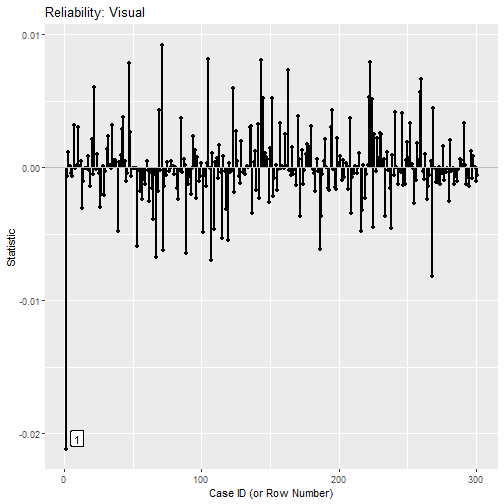
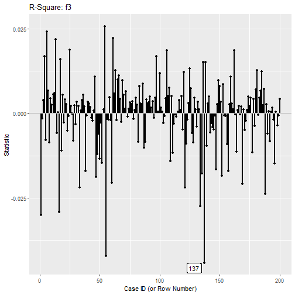

# Goal

This article illustrates how to
identify cases that are influential
on an arbitrary statistics computed
by any function, using
the [`semfindr`](https://sfcheung.github.io/semfindr/) package
.

Readers are assumed to have a basic
understanding on how to use `lavaan_rerun()`,
as illustrated in [this article](https://sfcheung.github.io/semfindr/articles/semfindr.html).

# Case Influence on Any Statistic

The function `user_change_raw()` can be
use to compute case influence measure
for any statistics as long as it is
provided a function that:

- accepts a `lavaan` object (e.g., the
  output of `lavaan::cfa()` or
  `lavaan::sem()`).

- returns a numeric vector of the
  statistics. If named, the names will
  be used. If not, names will be
  created automatically.

Different scenarios will be illustrated
below.

# Case 1: Reliability

We first illustrate computing case
influence on reliability.

The sample dataset `HolzingerSwineford1939`
from the `lavaan` package will be used
for illustration.


``` r
library(semfindr)
library(lavaan)
#> This is lavaan 0.6-19
#> lavaan is FREE software! Please report any bugs.
head(HolzingerSwineford1939)
#>   id sex ageyr agemo  school grade       x1   x2    x3       x4   x5        x6
#> 1  1   1    13     1 Pasteur     7 3.333333 7.75 0.375 2.333333 5.75 1.2857143
#> 2  2   2    13     7 Pasteur     7 5.333333 5.25 2.125 1.666667 3.00 1.2857143
#> 3  3   2    13     1 Pasteur     7 4.500000 5.25 1.875 1.000000 1.75 0.4285714
#> 4  4   1    13     2 Pasteur     7 5.333333 7.75 3.000 2.666667 4.50 2.4285714
#> 5  5   2    12     2 Pasteur     7 4.833333 4.75 0.875 2.666667 4.00 2.5714286
#> 6  6   2    14     1 Pasteur     7 5.333333 5.00 2.250 1.000000 3.00 0.8571429
#>         x7   x8       x9
#> 1 3.391304 5.75 6.361111
#> 2 3.782609 6.25 7.916667
#> 3 3.260870 3.90 4.416667
#> 4 3.000000 5.30 4.861111
#> 5 3.695652 6.30 5.916667
#> 6 4.347826 6.65 7.500000
```

For illustration, we add an influential
case:


``` r
dat <- HolzingerSwineford1939
dat[1, c("x1", "x2", "x3")] <- dat[1, c("x1", "x2", "x3")] +
                               c(-3, +3, 0)
```

A confirmatory factor analysis model
is to be fitted to the items `x1`
to `x9`:


``` r
mod <-
"
visual =~ x1 + x2 + x3
textual =~ x4 + x5 + x6
speed =~ x7 + x8 + x9
"
fit <- cfa(model = mod,
           data = dat)
```

## Leave-One-Out (LOO) Results

We first do LOO analysis, fitting
the model *n* times, *n* being the number
of cases, each time with one case removed:


``` r
fit_rerun <- lavaan_rerun(fit)
#> The expected CPU time is 27.09 second(s).
#> Could be faster if run in parallel.
```

## Reliability

Suppose we are interested in the
reliability of the three factors.
They can be computed by `compRelSEM()`
from `semTools`:


``` r
library(semTools)
#> 
#> ###############################################################################
#> This is semTools 0.5-6
#> All users of R (or SEM) are invited to submit functions or ideas for functions.
#> ###############################################################################
fit_rel <- compRelSEM(fit)
fit_rel
#>  visual textual   speed 
#>   0.594   0.885   0.688
```

We can compute the influence of each
case using `user_change_raw()`:


``` r
influence_rel <- user_change_raw(fit_rerun,
                                 user_function = compRelSEM)
```

The first argument is the output of
`lavaan_rerun()`.

The argument `user_function` is the
argument used to compute the statistics.

No other arguments are needed in this case
because `compRelSEM()` expects the
`lavaan` object as the first argument.

The output is an `est_change` object:


``` r
influence_rel
#> 
#> -- Case Influence on User Function --
#> 
#>     id visual  id textual  id  speed
#> 1    1 -0.021 262  -0.003 140  0.011
#> 2   71  0.009 113  -0.002 194  0.010
#> 3  268 -0.008 267   0.002 209  0.008
#> 4  105  0.008   1  -0.002 240  0.008
#> 5  143  0.008  53   0.002  78 -0.007
#> 6  223  0.008 194   0.002 152  0.007
#> 7   47  0.008 254  -0.002 205  0.007
#> 8  163  0.007 217   0.002 192 -0.007
#> 9  107 -0.007 252   0.002  69 -0.006
#> 10  67 -0.007 105  -0.002  34 -0.006
#> 
#> Note:
#> - Changes are raw changes if a case is included.
#> - Only the first 10 case(s) is/are displayed. Set 'first' to NULL to display all cases.
#> - Cases sorted by the absolute changes for each variable.
```

The influence is computed by:

- (User statistic with all case) - (User statistic without this case).

Therefore, if the value is positive for
a case, the statistic, reliability in
this case, is larger if this case is
included.

Conversely, if the value is negative
for a case, the statistic is decreases
if this case is included.

The function `index_plot()` can be used
to visualize the influence. For example,
this is the plot of case influence on
the reliability of `visual`.



The output is a `ggplot` object,
`column` needs to be set to the name
of the statistic to be plotted.
Refer to the help page of `index_plot()`
for other arguments available.

As shown by both the printout and the plot,
including the first case reduces the
reliability of `visual` by
0.021.

We can verify this by fitting the model
and compute the reliability without the
first case:


``` r
fit_no_1 <- cfa(model = mod,
                data = dat[-1, ])
fit_rel_no_1 <- compRelSEM(fit_no_1)
# Without the first case
fit_rel_no_1
#>  visual textual   speed 
#>   0.615   0.887   0.685
# Including the first case
fit_rel
#>  visual textual   speed 
#>   0.594   0.885   0.688
```

# Case 2: R-Squares

Suppose we use the compute case
influence on R-squares. This is the sample dataset,
`sem_dat`, comes with `semfindr`:


``` r
head(sem_dat)
#>           x1          x2         x3         x5         x4          x6
#> 1 -3.2135320 -0.09911249 -0.4745297 -2.8185015 -2.3237313 -0.12266637
#> 2 -0.1088671 -0.03470386 -2.2979899 -0.8178882 -0.9265397 -0.01402581
#> 3 -1.7961567 -1.58736219 -1.9552732  0.9009897 -0.5253893 -0.08915439
#> 4 -0.2033852 -2.13104958 -1.7085362 -0.7472562 -3.9749580  0.19330125
#> 5  2.2112260  1.47880579  0.2114521  0.5049098  0.2629869  2.29991139
#> 6 -1.2585361 -1.16345650 -2.9582246  0.8640491 -1.0727813 -2.07746666
#>            x7         x8         x9
#> 1  0.01778275  1.3242028  0.3511373
#> 2  1.81705005 -0.3905953 -0.5412106
#> 3  1.40417325 -0.3905477 -1.6177656
#> 4 -0.45070746 -2.3402317 -0.3714296
#> 5 -0.73314813 -0.1867083  0.4762137
#> 6  0.02449975 -0.2139832 -3.4676929
mod <-
"
f1 =~  x1 + x2 + x3
f2 =~  x4 + x5 + x6
f3 =~  x7 + x8 + x9
f2 ~ f1
f3 ~ f2 + f1
"
fit <- sem(mod,
           data = sem_dat)
```

The R-squares can be retrieved in
different ways. For example, it
can be extracted by `lavInspect()`
from `lavaan`:


``` r
lavInspect(fit, what = "rsquare")
#>    x1    x2    x3    x4    x5    x6    x7    x8    x9    f2    f3 
#> 0.330 0.166 0.324 0.675 0.425 0.187 0.102 0.315 0.486 0.463 0.596
```

Let's do LOO first:


``` r
fit_rerun <- lavaan_rerun(fit)
#> The expected CPU time is 9 second(s).
#> Could be faster if run in parallel.
```

We then call `user_change_raw()` to
compute case influence:


``` r
influence_rsq <- user_change_raw(fit_rerun,
                                 user_function = lavInspect,
                                 what = "rsquare")
```

This example illustrates an advanced
scenario. The function `lavInspect()`
requires one more argument, `what`, to
know that we want the R-squares. Such
arguments require by `user_function`
can be passed directly to `user_change_raw()`,
which will pass them to `user_function`.

This is the output:


``` r
influence_rsq
#> 
#> -- Case Influence on User Function --
#> 
#>     id     x1  id     x2  id     x3  id     x4  id     x5  id     x6  id     x7
#> 1   88 -0.029 100 -0.018 112 -0.028  46 -0.045  46  0.031  61  0.016  46  0.019
#> 2   61 -0.022 125  0.017 147 -0.028  61  0.028   6 -0.022  46  0.015  27 -0.012
#> 3  120 -0.019 109 -0.014  91 -0.021  99 -0.027 178  0.019  25  0.014 110  0.012
#> 4  110  0.019  96 -0.014  61  0.020  24 -0.026 137  0.019 128 -0.014  18  0.011
#> 5   21 -0.018 149  0.013  84 -0.020 178 -0.023 110  0.018 108 -0.014  30 -0.011
#> 6  180 -0.018  75 -0.012 126 -0.017  25  0.022  25 -0.018 149 -0.013 179  0.009
#> 7  162 -0.016 116 -0.011 110  0.016  87 -0.020 200 -0.017 175 -0.013  14 -0.009
#> 8  187 -0.014 179 -0.011  46  0.015 110 -0.018 149 -0.015 164  0.012  25  0.009
#> 9   46  0.013   4  0.010  13  0.015 197 -0.018 176 -0.015  60 -0.012   3 -0.009
#> 10  59  0.012  63  0.010   6  0.014   6  0.017  70 -0.014 178  0.011  19 -0.009
#>     id     x8  id     x9  id     f2  id     f3
#> 1  106 -0.027  54 -0.030  55 -0.029 137 -0.044
#> 2  125  0.023 162 -0.027 162 -0.029  55 -0.042
#> 3   59 -0.017 134 -0.026  46  0.028   1 -0.030
#> 4   75 -0.017  66 -0.024  35 -0.027  16 -0.029
#> 5  172 -0.017  97 -0.023 149 -0.026 134 -0.027
#> 6   17  0.015  14 -0.022 119 -0.025  54  0.026
#> 7   63  0.015  46  0.022 178  0.022   6  0.024
#> 8  179  0.014 136 -0.021   3 -0.022 188 -0.024
#> 9   61  0.013  63  0.021  49 -0.021  61  0.022
#> 10  25  0.013  25 -0.018 137  0.021 121 -0.022
#> 
#> Note:
#> - Changes are raw changes if a case is included.
#> - Only the first 10 case(s) is/are displayed. Set 'first' to NULL to display all cases.
#> - Cases sorted by the absolute changes for each variable.
```

We can use `index_plot()` again. Let's
plot case influence on the R-square of
`f3`:



The 137th case, if included, decreases
the R-square of `f3` by about
0.044,
as shown in both the printout and the
index plot.

# Final Remarks

The function `user_change_raw()` can also
be used for function for which the
`lavaan`-class object is not the first
argument. Please refer to the help
page of `user_change_raw()` on how to
set this argument.

# Reference
