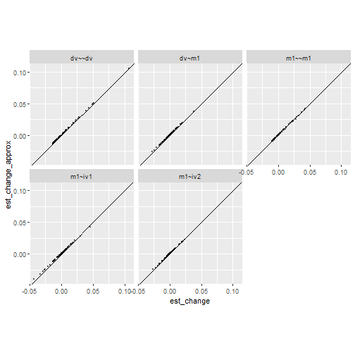
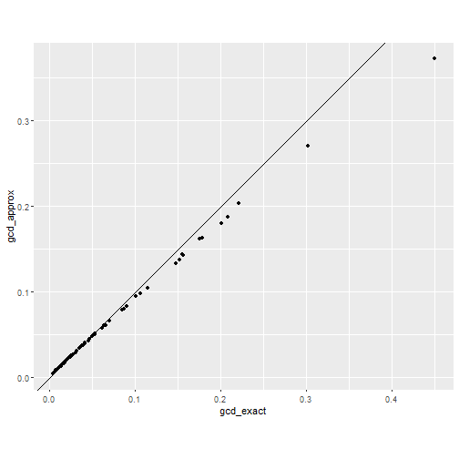
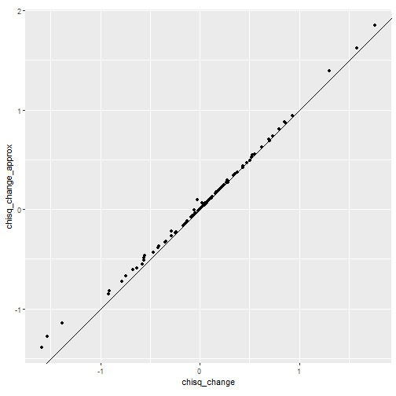
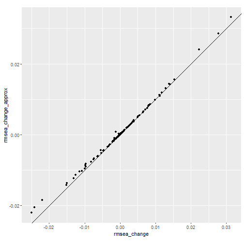

This vignette explains the computational shortcut implemented in [semfindr](https://sfcheung.github.io/semfindr/) to approximate the casewise influence. The approximation is most beneficial when the sample size *N* is large, where the approximation works better and the computational cost for refitting models *N* times is high.


``` r
library(semfindr)
dat <- pa_dat
```


``` r
library(lavaan)
mod <-
"
m1 ~ iv1 + iv2
dv ~ m1
"
fit <- sem(mod, dat)
```


## Using Scores to Approximate Case Influence

`lavaan` provides the handy `lavScores()` function to evaluate
$$s_i(\theta_m) = \frac{\partial \ell_i(\theta_m)}{\partial \theta_m}$$
for observation $i$, where $\ell_i(\theta)$ denotes the casewise loglikelihood function and $\theta_m$ is the $m$th model parameter.

For example,


``` r
head(lavScores(fit)[ , 1, drop = FALSE])
#>           m1~iv1
#> [1,]  0.23975993
#> [2,]  0.06630118
#> [3,] -0.33999129
#> [4,] -0.22536120
#> [5,]  0.61375747
#> [6,]  0.03747179
```

indicates the partial derivative of the casewise loglikelihod with respect to the parameter `m1~iv1`. Because the sum of the partial derivatives across all observations is zero at the maximum likelihood estimate with the full sample ($\hat \theta_m$; i.e., the derivative of loglikelihood of the full data is 0), $- s_i(\theta_m)$ can be used as an estimate of the partial derivative of the loglikelihood at $\hat \theta_m$ **for the sample without observation $i$**. This information can be used to approximate the maximum likelihood estimate for $\theta_m$ when case $i$ is dropped, denoted as $\hat \theta_{m(-i)}$

The second-order Taylor series expansion can be used to approximate the parameter vector estimate with an observation deleted, $\hat \theta_{(-i)}$, as in the iterative [Newton's method](https://en.wikipedia.org/wiki/Newton%27s_method_in_optimization). Specifically,

$$\hat \theta_{(i)} \approx \hat \theta - \frac{N}{N - 1}V(\hat \theta) \nabla \ell(\hat \theta)$$
$$\hat \theta - \hat \theta_{(i)} \approx \frac{N}{N - 1}V(\hat \theta) \nabla \ell_i(\hat \theta),$$
where $\nabla \ell_i(\hat \theta)$ is the gradient vector of the casewise loglikelihood with respect to the parameters (i.e., score). The $N / (N - 1)$ term is used to adjust for the decrease in sample size (this adjustment is trivial in large samples). This procedure should be the same as equation (4) of [Tanaka et al. (1991)](https://doi.org/10.1080/03610929108830742) (p. 3807) and is related to the one-step approximation described by [Cook and Weisberg (1982)](https://conservancy.umn.edu/handle/11299/37076) (p. 182).

### Comparison

The approximation is implemented in the `est_change_raw_approx()` function:


``` r
fit_est_change_approx <- est_change_raw_approx(fit)
fit_est_change_approx
#> 
#> -- Approximate Case Influence on Parameter Estimates --
#> 
#>    id m1~iv1  id m1~iv2 id  dv~m1  id m1~~m1 id dv~~dv
#> 1  51  0.042  43 -0.025 65  0.037  61  0.042 16  0.106
#> 2  43 -0.040  94  0.023 11 -0.027  85  0.040  9  0.050
#> 3  34 -0.032 100 -0.022 16 -0.024 100  0.037 76  0.049
#> 4  18 -0.028  85  0.021 32 -0.020  18  0.031 25  0.049
#> 5  13  0.028  20  0.020 99  0.020  42  0.028 91  0.043
#> 6  32 -0.025  32  0.019 79  0.018  43  0.025 17  0.039
#> 7  20 -0.024  65  0.019 93  0.018  32  0.023 26  0.028
#> 8  75  0.021  34 -0.018 22  0.017  34  0.022 65  0.027
#> 9  42 -0.020  64 -0.016 61 -0.016  40  0.022 62  0.027
#> 10 68  0.018  52  0.016 25 -0.015  20  0.022 90  0.024
#> 
#> Note:
#> - Changes are approximate raw changes if a case is included.
#> - Only the first 10 case(s) is/are displayed. Set 'first' to NULL to display all cases.
#> - Cases sorted by the absolute changes for each variable.
```

Here is a comparison between the approximation using `semfindr::est_change_raw_approx()` and `semfindr::est_change_raw()`


``` r
# From semfindr
fit_rerun <- lavaan_rerun(fit)
#> The expected CPU time is 1.5 second(s).
#> Could be faster if run in parallel.
fit_est_change_raw <- est_change_raw(fit_rerun)
# Plot the differences
library(ggplot2)
tmp1 <- as.vector(t(as.matrix(fit_est_change_raw)))
tmp2 <- as.vector(t(as.matrix(fit_est_change_approx)))
est_change_df <- data.frame(param = rep(colnames(fit_est_change_raw),
                                        nrow(fit_est_change_raw)),
                             est_change = tmp1,
                             est_change_approx = tmp2)
ggplot(est_change_df, aes(x = est_change, y = est_change_approx)) +
  geom_abline(intercept = 0, slope = 1) +
  geom_point(size = 0.8, alpha = 0.5) +
  facet_wrap(~ param) +
  coord_fixed()
```



The results are pretty similar.

### Generalized Cook's distance (*gCD*)

We can use the approximate parameter changes to approximate the *gCD* (see also Tanaka et al., 1991, equation 13, p. 3811):


``` r
# Information matrix (Hessian)
information_fit <- lavInspect(fit, what = "information")
# Short cut for computing quadratic form (https://stackoverflow.com/questions/27157127/efficient-way-of-calculating-quadratic-forms-avoid-for-loops)
gcd_approx <- (nobs(fit) - 1) * rowSums(
  (fit_est_change_approx %*% information_fit) * fit_est_change_approx
)
```

This is implemented in the `est_change_approx()` function:


``` r
fit_est_change_approx <- est_change_approx(fit)
fit_est_change_approx
#> 
#> -- Approximate Standardized Case Influence on Parameter Estimates --
#> 
#>     m1~iv1 m1~iv2  dv~m1 m1~~m1 dv~~dv gcd_approx
#> 16   0.052 -0.038 -0.228 -0.006  0.572      0.372
#> 43  -0.387 -0.249 -0.135  0.201  0.116      0.270
#> 65   0.150  0.189  0.355  0.071  0.148      0.203
#> 85  -0.170  0.211 -0.118  0.315 -0.054      0.187
#> 51   0.405 -0.052  0.094  0.075 -0.046      0.179
#> 34  -0.306 -0.186 -0.110  0.176  0.028      0.163
#> 32  -0.241  0.190 -0.189  0.181 -0.002      0.161
#> 20  -0.234  0.199 -0.140  0.172 -0.034      0.144
#> 18  -0.269  0.035  0.101  0.246 -0.048      0.143
#> 100 -0.001 -0.221 -0.069  0.290 -0.058      0.137
#> 
#> Note:
#> - Changes are approximate standardized raw changes if a case is included.
#> - Only the first 10 case(s) is/are displayed. Set 'first' to NULL to display all cases.
#> - Cases sorted by approximate generalized Cook's distance.
```


``` r
# Compare to exact computation
fit_est_change <- est_change(fit_rerun)
# Plot
gcd_df <- data.frame(
  gcd_exact = fit_est_change[ , "gcd"],
  gcd_approx = fit_est_change_approx[ , "gcd_approx"]
)
ggplot(gcd_df, aes(x = gcd_exact, y = gcd_approx)) +
  geom_abline(intercept = 0, slope = 1) +
  geom_point() +
  coord_fixed()
```



The approximation tend to  underestimate the actual *gCD* but the rank ordering is almost identical. This is discussed also in Tanaka et al. (1991), who proposed a correction by applying a one-step approximation after the correction (currently not implemented due to the need to recompute scores with updated parameter values).


``` r
cor(gcd_df, method = "spearman")
#>            gcd_exact gcd_approx
#> gcd_exact   1.000000   0.999892
#> gcd_approx  0.999892   1.000000
```

## Approximate Change in Fit

The casewise loglikelihood---the contribution to the likelihood function by an observation---can be computed in `lavaan`, which approximates the change in loglikelihood when an observation is deleted:


``` r
lli <- lavInspect(fit, what = "loglik.casewise")
head(lli)
#> [1] -2.776787 -2.034084 -2.154825 -2.248100 -2.793426 -2.049238
```

Here, $\ell(\hat \theta)$ will drop 2.78 when observation 1 is deleted. This should approximate $\ell(\hat \theta_{(-i)})$ as long as $\hat \theta_{(-i)}$ is not too different from $\hat \theta$. Here's a comparison:


``` r
# Predicted ll without observation 1
fit@loglik$loglik - lli[1]
#> [1] -289.8272
# Actual ll without observation 1
fit_no1 <- sem(mod, dat[-1, ])
fit_no1@loglik$loglik
#> [1] -289.8156
```

They are pretty close. To approximate the change in $\chi^2$, as well as other $\chi^2$-based fit indices, we can use the `fit_measures_change_approx()` function:


``` r
chisq_i_approx <- fit_measures_change_approx(fit)
# Compare to the actual chisq when dropping observation 1
c(predict = chisq_i_approx[1, "chisq"] + fitmeasures(fit, "chisq"),
  actual = fitmeasures(fit_no1, "chisq"))
#> predict.chisq  actual.chisq 
#>      6.871042      6.557397
```

### Comparing exact and approximate changes in fit indices

Change in $\chi^2$


``` r
# Exact measure from semfindr
out <- fit_measures_change(fit_rerun)
# Plot
chisq_change_df <- data.frame(
  chisq_change = out[ , "chisq"],
  chisq_change_approx = chisq_i_approx[ , "chisq"]
)
ggplot(chisq_change_df, aes(x = chisq_change, y = chisq_change_approx)) +
  geom_abline(intercept = 0, slope = 1) +
  geom_point() +
  coord_fixed()
```



Change in RMSEA


``` r
# Plot
rmsea_change_df <- data.frame(
  rmsea_change = out[ , "rmsea"],
  rmsea_change_approx = chisq_i_approx[ , "rmsea"]
)
ggplot(rmsea_change_df, aes(x = rmsea_change, y = rmsea_change_approx)) +
  geom_abline(intercept = 0, slope = 1) +
  geom_point() +
  coord_fixed()
```



The values aligned reasonably well along the 45-degree line.

# Limitations

- The approximate approach is tested only for models
  fitted by maximum likelihood (ML) with normal theory
  standard errors (the default).

- The approximate approach does not yet support multilevel
models.

The `lavaan` object will be checked by `approx_check()` to see if it is
supported. If not, an error will be raised.

# References

Cook, R. D., & Weisberg, S. (1982). *Residuals and influence in regression.* New York: Chapman and Hall. https://conservancy.umn.edu/handle/11299/37076

Tanaka, Y., Watadani, S., & Ho Moon, S. (1991). Influence in covariance structure analysis: With an application to confirmatory factor analysis. *Communications in Statistics - Theory and Methods, 20*(12), 3805–3821. https://doi.org/10.1080/03610929108830742
