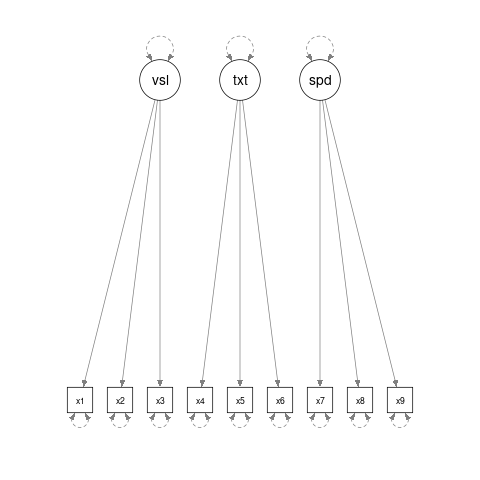

```{r, include = FALSE}
knitr::opts_chunk$set(
  collapse = TRUE,
  comment = "#>"
)
```

# Purpose

The "Quick Start" vignette shows an example of using `semfindr`
for path analysis with observed variables. This is an illustration
of using it for confirmatory factor analysis with latent variables.

The following sections illustrates how to use some of the
major functions.

# Fitting the Target Model

The sample dataset is `lavaan::HolzingerSwineford1939`, with variables
`x1` to `x9`, and 301 observations. For
convenience, we assign `HolzingerSwineford1939` to a new symbol, `dat`.

```{r}
library(semfindr)
data(HolzingerSwineford1939, package = "lavaan")
dat <- HolzingerSwineford1939
head(dat)
```

Assume that the target model under examination is a factor
model with three latent factors:

```{r}
mod <- " visual  =~ x1 + x2 + x3 
         textual =~ x4 + x5 + x6
         speed   =~ x7 + x8 + x9 "
```

```{r, include = FALSE}
# library(semPlot)
# png(file = "hs_cfa.png")
# semPaths(lavaan::lavaanify(mod))
# dev.off()
```



We fit the model by `lavaan::sem()`:

```{r}
library(lavaan)
fit <- cfa(mod, dat)
```

# Rerun *n* Times

We refit the model 100 times, each time with one case
removed:

```{r echo = FALSE, include = FALSE}
if (file.exists("semfindr_fit_rerun_cfa.RDS")) {
    fit_rerun <- readRDS("semfindr_fit_rerun_cfa.RDS")
  } else {
    fit_rerun <- lavaan_rerun(fit)
    saveRDS(fit_rerun, "semfindr_fit_rerun_cfa.RDS")
  }
```

```{r echo = FALSE}
fit_no1 <- sem(mod, dat[-1, ])
fit_no180 <- sem(mod, dat[-180, ])
```

```{r eval = FALSE}
fit_rerun <- lavaan_rerun(fit, parallel = TRUE)
```

With two cores, this example takes about 10 seconds
with parallel processing and two cores.

# Diagnostic Functions

## Standardized Changes in Estimates

One intuitive measure is to compute the changes in parameter
estimates if a case is deleted, with the changes standardized
by their standard errors (Pek & MacCallum, 2011, Equation 7):

```{r}
fit_est_change <- est_change(fit_rerun)
round(head(fit_est_change), 3)
```

For example, we can check which observations show 
the biggest impact on the covariance between `visual` and `textual`:

```{r}
# HL: Is it possible to automate these plots?
library(ggplot2)
fit_est_change_dat <- within(
  as.data.frame(fit_est_change),
  row_id <- as.integer(rownames(fit_est_change))
)
fit_est_change_dat |>
  ggplot(aes(x = row_id, y = `visual~~textual`)) +
  geom_point() +
  geom_segment(
    aes(xend = row_id, yend = 0),
    size = 1,
    lineend = "butt") +
  xlab("Row Number") +
  ggrepel::geom_label_repel(
    data = fit_est_change_dat |>
      subset(
        subset = abs(`visual~~textual`) >= 
          sort(abs(`visual~~textual`), decreasing = TRUE)[5]
      ),
    ggplot2::aes(label = row_id),
    position = ggplot2::position_dodge(.5))
```


If the standardized change of a parameter for a case is
positive, then
the estimate in the full sample is larger than that with
this case removed.

Let's examine the top five cases with the largest generalized Cook's
distance (Cook, 1977; Pek & MacCallum, 2011, Equation 6), `gcd`:

```{r}
i_top5 <- order(fit_est_change[, "gcd"], decreasing = TRUE)[1:5]
round(fit_est_change[i_top5, ], 3)
```

Pek and MacCallum recommended computing generalized Cook's
distance for subset of parameters that researchers would like
to assess case influence. This can be done by specifying the
parameters to be included. For
example, we may compute the changes and the
`gcd` only for the factor loadings, using the argument
`parameters`:

```{r}
# HL: Is it possible to specify a subset of parameters by operators?
fit_est_change_loadings_only <- est_change(
  fit_rerun,
  parameters = c("visual=~x2", "visual=~x3",
                 "textual=~x5", "textual=~x6",
                 "speed=~x8", "speed=~x9")
)
iload_top5 <- order(fit_est_change_loadings_only[, "gcd"],
                    decreasing = TRUE)[1:5]
round(fit_est_change_loadings_only[iload_top5, ], 3)
```

See the help
page of `semfindr::est_change()` for further information.

## Raw Changes in Estimates

The standardized changes in parameter may not be easy
to interpret. If the original units are interpretable,
we can compute the *raw* changes, that is, the changes
in parameter estimates if a case is deleted, not
standardized by their standard errors. This can be done
by `semfindr::est_change_raw()`:

```{r}
fit_est_change_raw <- est_change_raw(fit_rerun)
round(fit_est_change_raw[i_top5, ], 3)
```

If desired, `semfindr::est_change_raw()` can also compute the changes
in parameters in the *standardized solution*:

```{r}
fit_est_change_raw_std <- est_change_raw(fit_rerun,
                                         standardized = TRUE)
round(fit_est_change_raw_std[i_top5, ], 3)
```

Notice that the parameter estimates do not change for the latent variances
(e.g., `visual~~visual`), as those had a value of one in the standardized
solution. 

For example, these are standardized solutions of the full
sample and the sample with the 180th case removed:

```{r}
cbind(standardizedSolution(fit, se = FALSE),
      `delete case 180` = standardizedSolution(sem(mod, dat[-180,]),
                                               se = FALSE)[, 4])
```

`semfindr::est_change_raw()` also supports computing the changes
for selected parameters. See the Quick Start page and the help
page of `semfindr::est_change_raw()` for further information.

## Mahalanobis Distance

One commonly used measure for identifying outliers is
Mahalanobis distance (Mahalanobis, 1936; Pek & MacCallum,
2011, Equation 9). `semfindr::mahalanobis_rerun()` can be
used to compute the Mahalanobis distance of each case on
all the variables used in the target model:

```{r}
fit_md <- mahalanobis_rerun(fit_rerun)
round(fit_md[i_top5, , drop = FALSE], 3)
```

Note that a case with a large Mahalanobis distance is not
necessarily an influential case (Pek & MacCallum, 2011).
Therefore, if time allows,
influence measures should be examined to avoid overlooking
cases that are not extreme but are influential.

## Changes in Fit Measures

Another set of intuitive measures of influence is to compute
goodness of fit measures with a case deleted and measure
the changes. This can
be done by `semfindr::fit_measures_change()`, which simply
gets any fit measures supported by `lavaan::fitMeasures`
from the results from `semfindr::lavaan_rerun`:

```{r}
fit_mc <- fit_measures_change(fit_rerun,
                              fit_measures = c("chisq", "cfi", "tli", "rmsea"))
round(fit_mc[i_top5,], 3)
```

See the *Changes in Fit Measures* section on the Quick Start page
for more information.

For example, the change in RMSEA for the 180th case is
`r round(fit_mc[180, "cfi"], 3)`. Therefore, the CFI in the
full sample is higher than that with the 180th case removed,
and the difference is `r abs(round(fit_mc[180, "cfi"], 3))`.

## An All-In-One-Function

We can also use `semfindr::influence_stat()` to compute all the previous
measures, with the results presented in a matrix:

```{r}
fit_influence <- influence_stat(fit_rerun)
round(fit_influence[i_top5, ], 3)
```

# Diagnostic Plots

## Generalized Cook's Distance

To visualize the `gcd`, we can plot an index plot with cases
on the horizontal axis and the `gcd` on the vertical axis
using `semfindr:gcd_plot`:

```{r}
gcd_plot(fit_influence,
         cutoff_gcd = 0.5)
```

More options of `semfindr::gcd_plot()` can be found on its help page.

## Mahalanobis Distance

An index plot can be computed on the
Mahalanobis distance given by `semfindr::influence_stat()`:

```{r}
md_plot(fit_influence,
        cutoff_md = TRUE)
```

## Fit Measure vs. Generalized Cook's Distance

To examine how the overall change in parameter estimates
measured by `gcd` relates to a selected goodness of fit
(`gof`) measure, `semfindr::gcd_gof_plot()` can be used:

```{r}
gcd_gof_plot(fit_influence,
             fit_measure = "rmsea",
             cutoff_gcd = 0.5,
             cutoff_fit_measure = 0.02)
```

As can be seen, several data points can move the RMSEA by .02 or more in absolute values (just an arbitrary number). 

## Bubble Plot

We can also use `semfindr::gcd_gof_md_plot()` to plot a bubble plot
of a selected goodness of fit measure against Mahalanobis distance,
with the bubble size determined by generalized Cook's distance.
This plot is similar to the plot by `car::influencePlot()` for
regression models.

```{r}
gcd_gof_md_plot(fit_influence,
                fit_measure = "rmsea",
                largest_gcd = 3,
                largest_fit_measure = 3,
                largest_md = 3,
                circle_size = 15)
```

# References

Cook, R. D. (1977). Detection of influential observation in linear regression.
*Technometrics, 19*(1), 15–18.

Mahalanobis, P. C. (1936). On the generalized distance in statistics.
*Proceedings of the National Institute of Science of India*, 2, 49–55.

Pek, J., & MacCallum, R. (2011). Sensitivity analysis in structural equation
models: Cases and their influence. *Multivariate Behavioral Research, 46*(2),
202–228. https://doi.org/10.1080/00273171.2011.561068
