# Purpose

The [semfindr](https://sfcheung.github.io/semfindr/) package contains functions for doing structural
equation modeling (SEM) diagnostics, such as identifying
influential cases and computing various diagnostic measures.
This document illustrates how to use `semfindr` to do casewise sensitivity
analysis: Assessing the influence of a case on parameter estimates
and model fit measures.

It supports two approaches:
the leave-one-out approach presented
by Pek and MacCallum (2011), and the approximate approach
that approximates the influence of a case without refitting a model.
It can generate some plots based on similar
plots available in the `car` package by Fox and Weisberg (2019)
for casewise sensitivity analysis.

# Leave-One-Out Approach

Under this approach, for a case of concern, the model is fitted
again without this case, and then results such as parameter
estimates are compared. This approach is exact but can be
time consuming because the model needs to be fitted again
for each case under consideration.

## Workflow

To remove the need to refit the model many times whenever
a case influence statistic is requested, `semfindr` adopts
this workflow:

1. Decide cases to examine. All cases will be examined,
  by default.

2. For each selected case, remove it and refit the model.

3. Store the results.

4. Any case influence statistics can then computed without
   the need to repeat Step 2.

Users can do as much diagnostic analysis as they
want without repeating the time consuming refitting step.
Step 2 can also be conducted without the need to decide
in advance the influence statistics to compute. Some
statistics, such as generalized Cook's distance, is a
function of the parameters selected, and the parameters to
examine may depend on the results of other statistics
and so may change during the analysis.

The following sections illustrates how to use the
major functions.

## Fitting the Target Model

The sample dataset is `pa_dat`, provided in the package,
with variables
`iv1`, `iv2`, `m1`, and `dv`, and 100 cases. For
convenience, we assign `pa_dat` to a new symbol, `dat`.


``` r
library(semfindr)
dat <- pa_dat
head(dat)
#>            m1         dv        iv1         iv2
#> 1  0.32067106  1.4587148  0.2055776 -0.42187811
#> 2  0.15360231 -0.3809220  0.1853543  0.15229953
#> 3  0.35136439 -0.4886773  0.9151424  1.16670950
#> 4 -0.56529330 -0.9766142  0.2884440  0.04563409
#> 5 -1.60657017 -1.0948066 -0.5756171 -0.18184854
#> 6  0.03143301  0.5859886  0.1420111  0.06286986
```

Assume that the target model under examination is a path
model with two predictors, one mediator, and one outcome
variable:


``` r
mod <-
"
m1 ~ iv1 + iv2
dv ~ m1
"
```

We fit the model by `lavaan::sem()`:


``` r
library(lavaan)
fit <- sem(mod, dat)
```

## Rerun *n* Times (Step 1 to Step 3)

We refit the model 100 times, each time with one case
removed:


``` r
fit_rerun <- lavaan_rerun(fit)
#> The expected CPU time is 3 second(s).
#> Could be faster if run in parallel.
```

This example takes about 4 to 8 seconds. For larger samples
or more complicated models, `lavaan_rerun()` supports
parallel processing by setting `parallel` to `TRUE`.

`lavaan_rerun()` also supports selecting cases using
the Mahalanobis distance on all variables in the model or on
the residuals of outcome variables. See the help
page of `lavaan_rerun()` or
`vignette("selecting_cases", package = "semfindr")` for details.

If this process is slow, users can save the results by
`base::saveRDS()` such that users can load it for sensitivity
analysis later, without the need to repeat these steps in each
R session.

## Diagnostic Functions

### Standardized Changes in Parameter Estimates

One intuitive way to assess case influence is to compute
the changes in parameter
estimates if a case is included, with the changes standardized
by their standard errors (Pek & MacCallum, 2011, Equation 7):


``` r
fit_est_change <- est_change(fit_rerun)
fit_est_change
#> 
#> -- Standardized Case Influence on Parameter Estimates --
#> 
#>     m1~iv1 m1~iv2  dv~m1 m1~~m1 dv~~dv   gcd
#> 16   0.052 -0.038 -0.237 -0.004  0.624 0.450
#> 43  -0.403 -0.263 -0.135  0.223  0.120 0.302
#> 65   0.152  0.191  0.363  0.076  0.161 0.221
#> 85  -0.174  0.216 -0.119  0.335 -0.052 0.208
#> 51   0.421 -0.057  0.094  0.089 -0.044 0.200
#> 34  -0.314 -0.192 -0.109  0.189  0.030 0.178
#> 32  -0.247  0.195 -0.191  0.193  0.001 0.175
#> 18  -0.273  0.035  0.101  0.260 -0.046 0.156
#> 20  -0.239  0.204 -0.141  0.183 -0.032 0.156
#> 100 -0.001 -0.225 -0.069  0.305 -0.056 0.152
#> 
#> Note:
#> - Changes are standardized raw changes if a case is included.
#> - Only the first 10 case(s) is/are displayed. Set 'first' to NULL to display all cases.
#> - Cases sorted by generalized Cook's distance.
```

The output is a matrix-like object of the class "est_change",
with a print method (`print.est_change()`). By default,
the cases are sorted in descending order based on
generalized Cook's distance (`gcd`, described below),
and only the first 10 cases are printed.

The standardized change is a measure of *influence* if a case
is *included*. If the standardized change of a parameter for
a case is positive, then including this case increases
the estimate of this parameter.

For example, the standardized change of the path from `iv1`
to `m1` is 0.024 for the
first case. The estimates of this path with and without
the first case are 0.215 and
0.212, respectively. The estimate
of this path is larger when this case is included than when
this case is excluded. (Recall that
0.024 is the change
standardized by the standard error of the estimate).

`est_change()` also computes the generalized Cook's
distance (Cook, 1977; Pek & MacCallum, 2011, Equation 6),
*gCD* (labelled in lowercase in the output as `gcd`),
using the parameters examined. *gCD* is
analogous to Cook's distance in multiple regression. It
measures the overall influence in the parameters if a case
is included.


```
#>    m1~iv1 m1~iv2  dv~m1 m1~~m1 dv~~dv   gcd
#> 16  0.052 -0.038 -0.237 -0.004  0.624 0.450
#> 43 -0.403 -0.263 -0.135  0.223  0.120 0.302
#> 65  0.152  0.191  0.363  0.076  0.161 0.221
#> 85 -0.174  0.216 -0.119  0.335 -0.052 0.208
#> 51  0.421 -0.057  0.094  0.089 -0.044 0.200
```

Pek and MacCallum recommended computing generalized Cook's
distance for subset of parameters that researchers would like
to assess case influence. This can be done by specifying the
parameters to be included. For
example, we may compute the changes and the
*gCD* only for path coefficients, using the argument
`parameters`:


``` r
fit_est_change_paths_only <- est_change(fit_rerun,
                                        parameters = c("m1 ~ iv1",
                                                       "m1 ~ iv2",
                                                       "dv ~ m1"))
fit_est_change_paths_only
#> 
#> -- Standardized Case Influence on Parameter Estimates --
#> 
#>    m1~iv1 m1~iv2  dv~m1   gcd
#> 43 -0.403 -0.263 -0.135 0.238
#> 51  0.421 -0.057  0.094 0.190
#> 65  0.152  0.191  0.363 0.189
#> 34 -0.314 -0.192 -0.109 0.142
#> 32 -0.247  0.195 -0.191 0.138
#> 20 -0.239  0.204 -0.141 0.121
#> 85 -0.174  0.216 -0.119 0.093
#> 11  0.010  0.149 -0.257 0.088
#> 18 -0.273  0.035  0.101 0.087
#> 13  0.274  0.059 -0.068 0.082
#> 
#> Note:
#> - Changes are standardized raw changes if a case is included.
#> - Only the first 10 case(s) is/are displayed. Set 'first' to NULL to display all cases.
#> - Cases sorted by generalized Cook's distance.
```


If all paths are to be included, the following call will also work:


``` r
fit_est_change_paths_only <- est_change(fit_rerun,
                                        parameters = c("~"))
```


Although the
16^th^ case has the
largest *gCD* based on all parameters, the
43^th^ case has the
largest *gCD* based on regression paths only. Therefore,
when examining *gCD*, it is better to compute it only for parameters
that are theoretically important.

See the help
page of `est_change()` for further information.

### Raw Changes in Parameter Estimates

The standardized changes in parameter may not be easy
to interpret. If the original units are interpretable,
users can compute the *raw* changes, that is, the changes
in parameter estimates if a case is included, not
standardized by their standard errors. This can be done
by `est_change_raw()`:


``` r
fit_est_change_raw <- est_change_raw(fit_rerun)
fit_est_change_raw
#> 
#> -- Case Influence on Parameter Estimates --
#> 
#>    id m1~iv1  id m1~iv2 id  dv~m1  id m1~~m1 id dv~~dv
#> 1  51  0.046  43 -0.026 65  0.039  61  0.043 16  0.108
#> 2  43 -0.043  94  0.024 11 -0.027  85  0.041  9  0.051
#> 3  34 -0.033 100 -0.022 16 -0.024 100  0.038 76  0.050
#> 4  13  0.030  85  0.021 32 -0.021  18  0.032 25  0.050
#> 5  18 -0.029  20  0.020 99  0.020  42  0.029 91  0.043
#> 6  32 -0.026  32  0.019 79  0.019  43  0.028 17  0.039
#> 7  20 -0.025  65  0.019 93  0.018  32  0.024 65  0.030
#> 8  75  0.021  34 -0.019 22  0.017  34  0.024 26  0.029
#> 9  42 -0.020  64 -0.017 61 -0.017  20  0.023 62  0.027
#> 10 68  0.020  52  0.016 25 -0.015  40  0.023 90  0.024
#> 
#> Note:
#> - Changes are raw changes if a case is included.
#> - Only the first 10 case(s) is/are displayed. Set 'first' to NULL to display all cases.
#> - Cases sorted by the absolute changes for each variable.
```

The output is a matrix-like object of the class "est_change",
with a print method (`print.est_change()`). If the
output was generated `est_change_raw()`, by default,
each column of parameter is sorted in the descending order
of the absolute value, with case IDs inserted.

For example, the change of the path from `iv1`
to `m1` is -0.043
for the
43^rd^ case. The estimate of this path with and without
the 43^rd^ cases are 0.215 and
0.258, respectively. The
estimate with the 43^rd^ case included is smaller than the
estimate with the 43^rd^ case excluded. The raw changes is
0.215 -
0.258 or
-0.043.

If desired, `est_change_raw()` can also compute the changes
in parameters in the *standardized solution*, by
setting `standardized` to `TRUE`:


``` r
fit_est_change_raw_std <- est_change_raw(fit_rerun,
                                         standardized = TRUE)
fit_est_change_raw_std
#> 
#> -- Case Influence on Standardized Parameter Estimates --
#> 
#>    id m1~iv1  id m1~iv2 id  dv~m1  id m1~~m1 id dv~~dv id iv1~~iv1 id iv1~~iv2
#> 1  51  0.042 100 -0.023 16 -0.033  43  0.026 16  0.030  1        0 87   -0.041
#> 2  43 -0.032  43 -0.021 65  0.029  94 -0.022 65 -0.024  2        0 60   -0.035
#> 3  13  0.028  94  0.020 25 -0.018 100  0.022 25  0.017  3        0 45    0.029
#> 4  34 -0.026  99  0.019 11 -0.018  34  0.021 11  0.016  4        0 91   -0.027
#> 5  18 -0.025  34 -0.017 99  0.016  99 -0.019 99 -0.013  5        0 27    0.025
#> 6  32 -0.023  87  0.016 93  0.015  52 -0.016  9  0.013  6        0 43    0.024
#> 7  20 -0.023  52  0.015  9 -0.014  65 -0.016 93 -0.013  7        0 57   -0.024
#> 8  68  0.021  40 -0.013 22  0.014  27 -0.014 43  0.012  8        0 50    0.024
#> 9  85 -0.020  20  0.012 43 -0.013  40  0.013 22 -0.012  9        0 69    0.022
#> 10 42 -0.019  61 -0.012 79  0.013  18  0.013 79 -0.011 10        0 71    0.020
#>    id iv2~~iv2
#> 1   1        0
#> 2   2        0
#> 3   3        0
#> 4   4        0
#> 5   5        0
#> 6   6        0
#> 7   7        0
#> 8   8        0
#> 9   9        0
#> 10 10        0
#> 
#> Note:
#> - Changes are raw changes if a case is included.
#> - Only the first 10 case(s) is/are displayed. Set 'first' to NULL to display all cases.
#> - Cases sorted by the absolute changes for each variable.
```

Note that the variances of `iv1` and `iv2` are necessarily
equal to one in the standardized solution and so the raw
changes are equal to zero for all cases.

For example, these are standardized solutions of the full
sample and the sample with the 43rd case removed:


``` r
standardizedSolution(fit, se = FALSE)[1, ]
#>   lhs op rhs est.std
#> 1  m1  ~ iv1   0.178
standardizedSolution(sem(mod, dat[-43, ]), se = FALSE)[1, ]
#>   lhs op rhs est.std
#> 1  m1  ~ iv1    0.21
```

The change of the standardized estimate of the path from `iv1`
to `m1` is -0.032
for the
43^rd^ case. The standardized estimates of this path with and
without
the 43^rd^ cases are
0.178
and
0.21,
respectively. The
estimate of the standardized coefficient from `iv1` to `m1`
is smaller than the estimate with the 43^rd^
case removed. The raw changes of standardized estimate is
0.178 -
0.21 or
-0.032.

`est_change_raw()` also supports computing the changes
for selected parameters:


``` r
fit_est_change_raw_std_paths <- est_change_raw(fit_rerun,
                                               standardized = TRUE,
                                               parameters = c("m1 ~ iv1",
                                                              "m1 ~ iv2",
                                                              "dv ~ m1"))
fit_est_change_raw_std_paths
#> 
#> -- Case Influence on Standardized Parameter Estimates --
#> 
#>    id  dv~m1 id m1~iv1  id m1~iv2
#> 1  16 -0.033 51  0.042 100 -0.023
#> 2  65  0.029 43 -0.032  43 -0.021
#> 3  25 -0.018 13  0.028  94  0.020
#> 4  11 -0.018 34 -0.026  99  0.019
#> 5  99  0.016 18 -0.025  34 -0.017
#> 6  93  0.015 32 -0.023  87  0.016
#> 7   9 -0.014 20 -0.023  52  0.015
#> 8  22  0.014 68  0.021  40 -0.013
#> 9  43 -0.013 85 -0.020  20  0.012
#> 10 79  0.013 42 -0.019  61 -0.012
#> 
#> Note:
#> - Changes are raw changes if a case is included.
#> - Only the first 10 case(s) is/are displayed. Set 'first' to NULL to display all cases.
#> - Cases sorted by the absolute changes for each variable.
```

If all parameters of the same operators are to be included,
e.g., `"~"` for all regression paths, this form will also work:


``` r
fit_est_change_raw_std_paths <- est_change_raw(fit_rerun,
                                               standardized = TRUE,
                                               parameters = c("~"))
```


See the help
page of `est_change_raw()` for further information.

### Mahalanobis Distance

One commonly used measure for identifying outliers is
Mahalanobis distance (Mahalanobis, 1936; Pek & MacCallum,
2011, Equation 9). `mahalanobis_rerun()` can be
used to compute the Mahalanobis distance of each case on
all the variables used in the target model:


``` r
fit_md <- mahalanobis_rerun(fit_rerun)
fit_md
#> 
#> -- Mahalanobis Distance --
#> 
#>        md
#> 16 11.530
#> 99 11.312
#> 87 11.091
#> 43 10.181
#> 51  9.869
#> 13  8.476
#> 91  8.078
#> 71  7.757
#> 17  7.555
#> 68  7.472
#> 
#> Note:
#> - Only the first 10 case(s) is/are displayed. Set 'first' to NULL to display all cases.
#> - Cases sorted by Mahalanobis distance in decreasing order.
```

The output is a matrix-like object of the class "md_semfindr",
with a print method (`print.md_semfindr()`). By default,
cases are sorted in descending order of Mahalanobis
distance.

Note that a case with a large Mahalanobis distance is not
necessarily an influential case (Pek & MacCallum, 2011).
Therefore,
influence measures should be examined to avoid overlooking
cases that are not extreme but are influential.

See the help
page of `mahalanobis_rerun()` for further information.

### Changes in Fit Measures

Another intuitive measure of influence is
the difference in a measure of model fit between the analysis
with a case included and that with the case excluded. This can
be done by `fit_measures_change()`, which simply
gets any fit measures supported by `lavaan::fitMeasures()`
from the results from `lavaan_rerun`:


``` r
fit_mc <- fit_measures_change(fit_rerun,
            fit_measures = c("chisq", "cfi", "tli", "rmsea"))
fit_mc
#> 
#> -- Case Influence on Fit Measures --
#> 
#>     chisq    cfi    tli  rmsea
#> 1   0.154 -0.002 -0.005  0.002
#> 2  -0.019  0.001  0.003 -0.001
#> 3  -0.417  0.008  0.021 -0.007
#> 4  -0.154  0.004  0.009 -0.003
#> 5   0.097  0.000  0.001  0.001
#> 6   0.116 -0.001 -0.003  0.001
#> 7  -0.631  0.014  0.034 -0.011
#> 8   0.120  0.002  0.005  0.001
#> 9   0.524 -0.012 -0.030  0.008
#> 10  0.697 -0.013 -0.033  0.011
#> 
#> Note:
#> - Only the first 10 case(s) is/are displayed. Set 'first' to NULL to display all cases.
```

The output is a matrix-like object of the class "fit_measures_change",
with a print method (`print.fit_measures_change()`). By default,
only the first 10 cases are printed.

To sort cases by a specific measure, set `sort_by` to the
column name to be used for sorting cases. By default,
cases are sorted in descending order of the *absolute* value
of the selected column.


``` r
print(fit_mc, sort_by = "chisq")
#> 
#> -- Case Influence on Fit Measures --
#> 
#>     chisq    cfi    tli  rmsea
#> 91  1.760 -0.034 -0.085  0.031
#> 17 -1.591  0.027  0.066 -0.025
#> 25  1.580 -0.031 -0.079  0.028
#> 16 -1.533  0.019  0.048 -0.024
#> 87 -1.381  0.030  0.074 -0.022
#> 43  1.306 -0.030 -0.075  0.022
#> 90  0.930 -0.016 -0.039  0.015
#> 97 -0.919  0.017  0.042 -0.015
#> 13 -0.909  0.020  0.050 -0.015
#> 62  0.863 -0.015 -0.038  0.014
#> 
#> Note:
#> - Only the first 10 case(s) is/are displayed. Set 'first' to NULL to display all cases.
#> - Cases sorted by chisq in decreasing order on absolute values.
```

The value is computed by $M_\textrm{full sample} - M_\textrm{one case removed}$.
Therefore, if the value for a case is positive, the measure is
higher when this case is included than when this case is excluded.
If the value is negative, the measure
is smaller when this case is included than when this case is excluded.
This convention is selected such
that the interpretation is consistent with that for
changes in parameter estimates.

For example, the change in CFI for the 43rd case is
-0.03. Therefore, including the 43rd Case
yields a CFI smaller than when this case is exclude,
and the difference is 0.03.

The argument `fit_measures` is passed to `lavaan::fitMeasures()`
to specify the measures to be computed. The default values are
`c("chisq", "cfi", "tli", "rmsea")`. Therefore, this argument can be omitted
if they are the desired measures of fit:


``` r
fit_mc <- fit_measures_change(fit_rerun)
```

See the help
page of `fit_measures_change()` for further information.

### An All-In-One-Function

We can also use `influence_stat()` to compute the previous
measures. It calls `fit_measures_change()`, `est_change()`,
and `mahalanobis_rerun()` and then merges
their results into one object:


``` r
fit_influence <- influence_stat(fit_rerun)
fit_influence
#> 
#> -- Standardized Case Influence on Parameter Estimates --
#> 
#>     m1~iv1 m1~iv2  dv~m1 m1~~m1 dv~~dv   gcd
#> 16   0.052 -0.038 -0.237 -0.004  0.624 0.450
#> 43  -0.403 -0.263 -0.135  0.223  0.120 0.302
#> 65   0.152  0.191  0.363  0.076  0.161 0.221
#> 85  -0.174  0.216 -0.119  0.335 -0.052 0.208
#> 51   0.421 -0.057  0.094  0.089 -0.044 0.200
#> 34  -0.314 -0.192 -0.109  0.189  0.030 0.178
#> 32  -0.247  0.195 -0.191  0.193  0.001 0.175
#> 18  -0.273  0.035  0.101  0.260 -0.046 0.156
#> 20  -0.239  0.204 -0.141  0.183 -0.032 0.156
#> 100 -0.001 -0.225 -0.069  0.305 -0.056 0.152
#> 
#> Note:
#> - Changes are standardized raw changes if a case is included.
#> - Only the first 10 case(s) is/are displayed. Set 'first' to NULL to display all cases.
#> - Cases sorted by generalized Cook's distance.
#> 
#> -- Case Influence on Fit Measures --
#> 
#>     chisq    cfi  rmsea    tli
#> 1   0.154 -0.002  0.002 -0.005
#> 2  -0.019  0.001 -0.001  0.003
#> 3  -0.417  0.008 -0.007  0.021
#> 4  -0.154  0.004 -0.003  0.009
#> 5   0.097  0.000  0.001  0.001
#> 6   0.116 -0.001  0.001 -0.003
#> 7  -0.631  0.014 -0.011  0.034
#> 8   0.120  0.002  0.001  0.005
#> 9   0.524 -0.012  0.008 -0.030
#> 10  0.697 -0.013  0.011 -0.033
#> 
#> Note:
#> - Only the first 10 case(s) is/are displayed. Set 'first' to NULL to display all cases.
#> 
#> -- Mahalanobis Distance --
#> 
#>        md
#> 16 11.530
#> 99 11.312
#> 87 11.091
#> 43 10.181
#> 51  9.869
#> 13  8.476
#> 91  8.078
#> 71  7.757
#> 17  7.555
#> 68  7.472
#> 
#> Note:
#> - Only the first 10 case(s) is/are displayed. Set 'first' to NULL to display all cases.
#> - Cases sorted by Mahalanobis distance in decreasing order.
```

The output is a matrix-like object of the class "influence_stat",
with a print method (`print.influence_stat()`). If printed,
it will print the results using the methods described above.

One major use of `influence_stat()` is to provide information
for the diagnostic plots introduced below.

## Diagnostic Plots

`semfindr` provides several functions to generate diagnostic
plots. All these functions accept an output of
`influence_stat()`
and returns a `ggplot2` plot, which can be further customized
if desired by other `ggplot2` functions.

### Generalized Cook's Distance

To visualize the *gCDs* of cases, we can plot an index plot with cases
on the horizontal axis and the *gCD* on the vertical axis
using `gcd_plot()`:


``` r
gcd_plot(fit_influence,
         largest_gcd = 3)
```

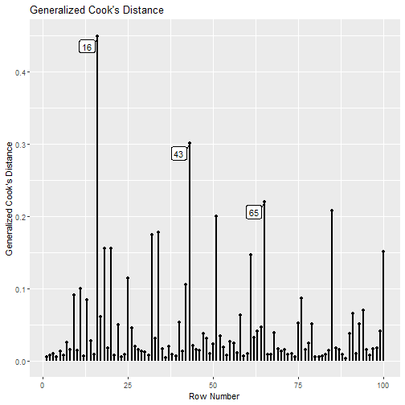

The plot shows that, compared to other cases, the 16th case
has the largest *gCD* (based on all free parameters).

`largest_gcd` controls the number of cases with the largest
`gcd` to be labelled. The default is 1.

More options of `gcd_plot()` can be found on its help page.

### Mahalanobis Distance

An index plot can be computed on the
Mahalanobis distance given by `influence_stat()`:


``` r
md_plot(fit_influence,
        largest_md = 3)
```


This plot illustrates that, although the 87th and 99th
cases are also large on Mahalanobis distance, they are
not influential cases when assessed by *gCD*.

`largest_m` is used to control how many cases with
high Mahalanobis distance on all the variables in the
fitted model will be labelled. The default is 1.

More options for `md_plot()` can be found on its help
page.

### Change in Fit Measure vs. Generalized Cook's Distance

To examine how *gCD* relates to a selected measure of model
fit
(`gof`), `gcd_gof_plot()` can be used:


``` r
gcd_gof_plot(fit_influence,
             fit_measure = "rmsea",
             largest_gcd = 3,
             largest_fit_measure = 3)
```

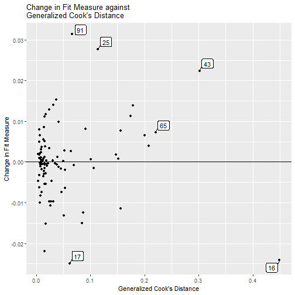

`largest_gcd` determines the number of cases with largest
`gcd` to be labelled, and `largest_fit_measure` determines
the number of cases with largest *absolute* change in
the selected measure of model fit to be labelled.
The default is 1 for both arguments.

More options of `gcd_gof_plot()` can be found on its help
page.

### Bubble Plot

The function `gcd_gof_md_plot()` can be used to plot a
bubble plot
of a selected measure of model fit against Mahalanobis distance,
with the bubble size determined by generalized Cook's distance.
This plot is similar to the plot by `car::influencePlot()` for
regression models.


``` r
gcd_gof_md_plot(fit_influence,
                fit_measure = "rmsea",
                largest_gcd = 3,
                largest_fit_measure = 3,
                largest_md = 3,
                circle_size = 15)
```

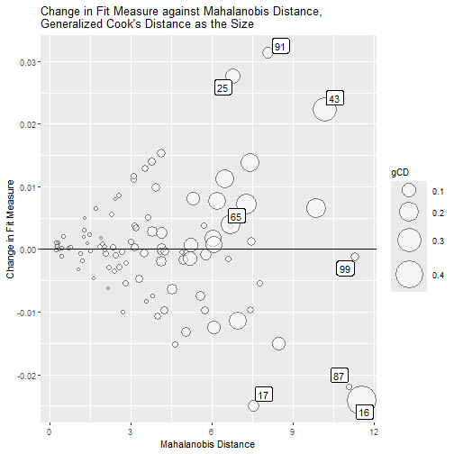

`circle_size` controls the size of the largest bubble. Increase
this number when the size difference is too small between bubbles.
`largest_gcd`, `largest_fit_measure`, and `largest_md`
controls the number of cases with highest absolute values
one the these measures to be labelled. Their default values
are 1.

More options of `gcd_gof_md_plot()` can be found
from its help page.

### Index Plot of Standardized or Raw Changes in Parameter Estimates

The function `est_change_plot()` can be used to plot an index
plot of standardized or raw changes using the output of
`est_change()` or `est_change_raw()`.

For example, using the output generated by
`est_change()` above, it
can generate an index plot for each parameter:


``` r
est_change_plot(fit_est_change,
                largest_change = 3)
```

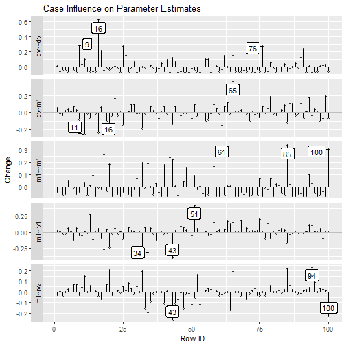

`largest_change` controls the number of cases with the largest
change to be labelled. The default is 1. The cases to be
labelled is determined separately for each parameter.

The function also supports plotting the changes only for
selected parameters, using `parameters`:


``` r
est_change_plot(fit_est_change,
                parameters = "~",
                largest_change = 3)
```


It can also plot the raw changes. For example:


``` r
est_change_plot(fit_est_change_raw,
                parameters = "~",
                largest_change = 3)
```


Last, the output of `influence_stat()` can also be
used. The case influence will be extracted from the
object. For example, the following call, using
`fit_influence` instead of `fit_est_change_raw`,
will generate the same plot.


``` r
est_change_plot(fit_influence,
                parameters = "~",
                largest_change = 3)
```

More options of `est_change_plot()` can be found on its help
page.

### Standardized Changes Against *gCD*

The function `est_change_gcd_plot()` can be used to plot,
for each selected parameter, casewise standardized
changes using the output of `est_change()` against *gCD*.

For example, using the output generated by
`est_change()` above, it
can generate an index plot for each parameter:


``` r
est_change_gcd_plot(fit_est_change,
                    largest_gcd = 3)
```

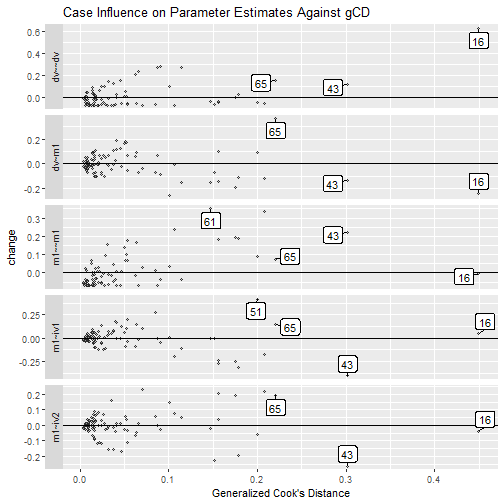

`largest_gcd` controls the number of cases with the largest
*gCD* to be labelled. The default is 1.

The function also supports plotting the changes only for
selected parameters, using `parameters`:


``` r
est_change_gcd_plot(fit_est_change,
                    parameters = "~",
                    largest_gcd = 3)
```

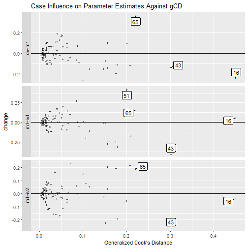

It does not support plotting the raw changes against *gCD*
because *gCD* is not computed by `est_change_raw()`.

Last, the output of `influence_stat()` can also be
used. The case influence will be extracted from the
object. For example, the following call, using
`fit_influence` instead of `fit_est_change`,
will generate the same plot.


``` r
est_change_gcd_plot(fit_influence,
                    parameters = "~",
                    largest_gcd = 3)
```


More options of `est_change_gcd_plot()` can be found on its help
page.

# Approximate Approach

The leave-one-out approach is exact because the model is fitted
twice, with and without the target case. However, this can be
time consuming for some models and datasets. The `semfindr`
package also supports the approximate approach that uses
casewise scores (from `lavaan::lavScores()`) and casewise
likelihood to approximate the influence of a case *without*
refitting a model. This approach is not exact but is much
faster than the leave-one-out approach because the model
is not fitted again.

This approach
can be used together with the leave-one-out approach, using
the approximate approach to identify potentially influential
cases and then use the leave-one-out approach to compute
the exact influence.

Most the functions for the leave-one-out approach has their
approximate approach counterparts. Therefore, only their usage
will be illustrated here. Please refer to the previous section
on the meanings of the influence statistics. The major
difference is, all functions for the approximate approach
use the output of `lavaan` directly. There is no need to use
`lavaan_rerun()`.

For the technical details on the approximate approach,
please refer to the
vignette *Approximate Case Influence Using Scores and Casewise Likelihood*
(`vignette("casewise_scores", package = "semfindr")`).

## Diagnostic Functions

### Approximate Standardized Changes in Parameter Estimates

The function `est_change_approx()` can be used to
compute the approximate standardized change. The first argument
is the output of `lavaan`:


``` r
fit_est_change_approx <- est_change_approx(fit)
fit_est_change_approx
#> 
#> -- Approximate Standardized Case Influence on Parameter Estimates --
#> 
#>     m1~iv1 m1~iv2  dv~m1 m1~~m1 dv~~dv gcd_approx
#> 16   0.052 -0.038 -0.228 -0.006  0.572      0.372
#> 43  -0.387 -0.249 -0.135  0.201  0.116      0.270
#> 65   0.150  0.189  0.355  0.071  0.148      0.203
#> 85  -0.170  0.211 -0.118  0.315 -0.054      0.187
#> 51   0.405 -0.052  0.094  0.075 -0.046      0.179
#> 34  -0.306 -0.186 -0.110  0.176  0.028      0.163
#> 32  -0.241  0.190 -0.189  0.181 -0.002      0.161
#> 20  -0.234  0.199 -0.140  0.172 -0.034      0.144
#> 18  -0.269  0.035  0.101  0.246 -0.048      0.143
#> 100 -0.001 -0.221 -0.069  0.290 -0.058      0.137
#> 
#> Note:
#> - Changes are approximate standardized raw changes if a case is included.
#> - Only the first 10 case(s) is/are displayed. Set 'first' to NULL to display all cases.
#> - Cases sorted by approximate generalized Cook's distance.
```

The output is a matrix-like object of the class "est_change",
with a print method (`print.est_change()`). By default,
the cases are sorted in descending order based on
approximate generalized Cook's distance (`gcd_approx`,
described below), and only the first 10 cases are printed.

The column `gcd_approx` indicates that the *gCD* is only
an approximate value.

Like `est_change()`, it also supports computing the
approximate *gCD* based on selected parameters. For example,
the following computes the *gCD* based on regression coefficients only:


``` r
fit_est_change_approx_paths <- est_change_approx(fit,
                                                 parameters = "~")
fit_est_change_approx_paths
#> 
#> -- Approximate Standardized Case Influence on Parameter Estimates --
#> 
#>    m1~iv1 m1~iv2  dv~m1 gcd_approx
#> 43 -0.387 -0.249 -0.135      0.217
#> 65  0.150  0.189  0.355      0.177
#> 51  0.405 -0.052  0.094      0.172
#> 34 -0.306 -0.186 -0.110      0.132
#> 32 -0.241  0.190 -0.189      0.130
#> 20 -0.234  0.199 -0.140      0.114
#> 85 -0.170  0.211 -0.118      0.087
#> 11  0.010  0.149 -0.254      0.084
#> 18 -0.269  0.035  0.101      0.082
#> 13  0.267  0.056 -0.068      0.076
#> 
#> Note:
#> - Changes are approximate standardized raw changes if a case is included.
#> - Only the first 10 case(s) is/are displayed. Set 'first' to NULL to display all cases.
#> - Cases sorted by approximate generalized Cook's distance.
```

See the help
page of `est_change_approx()` for further information.

### Approximate Raw Changes in Parameter Estimates

The function `est_change_raw_approx()` computes
the approximate raw changes of parameter estimates, not
standardized by their standard errors. The first argument
is the output of `lavaan`:


``` r
fit_est_change_raw_approx <- est_change_raw_approx(fit)
fit_est_change_raw_approx
#> 
#> -- Approximate Case Influence on Parameter Estimates --
#> 
#>    id m1~iv1  id m1~iv2 id  dv~m1  id m1~~m1 id dv~~dv
#> 1  51  0.042  43 -0.025 65  0.037  61  0.042 16  0.106
#> 2  43 -0.040  94  0.023 11 -0.027  85  0.040  9  0.050
#> 3  34 -0.032 100 -0.022 16 -0.024 100  0.037 76  0.049
#> 4  18 -0.028  85  0.021 32 -0.020  18  0.031 25  0.049
#> 5  13  0.028  20  0.020 99  0.020  42  0.028 91  0.043
#> 6  32 -0.025  32  0.019 79  0.018  43  0.025 17  0.039
#> 7  20 -0.024  65  0.019 93  0.018  32  0.023 26  0.028
#> 8  75  0.021  34 -0.018 22  0.017  34  0.022 65  0.027
#> 9  42 -0.020  64 -0.016 61 -0.016  40  0.022 62  0.027
#> 10 68  0.018  52  0.016 25 -0.015  20  0.022 90  0.024
#> 
#> Note:
#> - Changes are approximate raw changes if a case is included.
#> - Only the first 10 case(s) is/are displayed. Set 'first' to NULL to display all cases.
#> - Cases sorted by the absolute changes for each variable.
```

The output is a matrix-like object of the class "est_change",
with a print method (`print.est_change()`). If the
output was generated `est_change_raw_approx()`, by default,
each column of parameter is sorted in the descending order
of the absolute value, with case IDs inserted.

Unlike `est_change_raw()`, `est_change_raw_approx()`
does not support raw changes in the standardized solution.

See the help
page of `est_change_raw_approx()` for further information.

### Mahalanobis Distance

The function `mahalanobis_rerun()` actually does not
need the leave-one-out approach. Therefore, it can also be
used in the approximate approach by setting the first argument
to the output of `lavaan`:


``` r
fit_md <- mahalanobis_rerun(fit)
fit_md
#> 
#> -- Mahalanobis Distance --
#> 
#>        md
#> 16 11.530
#> 99 11.312
#> 87 11.091
#> 43 10.181
#> 51  9.869
#> 13  8.476
#> 91  8.078
#> 71  7.757
#> 17  7.555
#> 68  7.472
#> 
#> Note:
#> - Only the first 10 case(s) is/are displayed. Set 'first' to NULL to display all cases.
#> - Cases sorted by Mahalanobis distance in decreasing order.
```

The results are the same whether the output of `lavaan` or
`lavaan_reun()` is used.

### Approximate Changes in Fit Measures

The function `fit_measures_change_approx()` computes
the approximate changes in selected fit measures. The first
argument is the output of `lavaan`:


``` r
fit_mc_approx <- fit_measures_change_approx(fit,
                   fit_measures = c("chisq", "cfi", "tli", "rmsea"))
fit_mc_approx
#> 
#> -- Approximate Case Influence on Fit Measures --
#> 
#>     chisq    cfi    tli  rmsea
#> 1   0.160 -0.002 -0.005  0.002
#> 2  -0.019  0.001  0.003 -0.001
#> 3  -0.389  0.008  0.019 -0.007
#> 4  -0.151  0.004  0.009 -0.003
#> 5   0.097  0.000  0.001  0.001
#> 6   0.116 -0.001 -0.003  0.001
#> 7  -0.596  0.013  0.032 -0.010
#> 8   0.119  0.002  0.005  0.001
#> 9   0.543 -0.012 -0.031  0.008
#> 10  0.703 -0.013 -0.033  0.011
#> 
#> Note:
#> - Only the first 10 case(s) is/are displayed. Set 'first' to NULL to display all cases.
```

The output is a matrix-like object of the class "fit_measures_change",
with a print method (`print.fit_measures_change()`). By default,
only the first 10 cases are printed.

To sort cases by a specific measure, set `sort_by` to the
column name to be used for sorting cases. By default,
cases are sorted in descending order of the *absolute* value
of the selected column.


``` r
print(fit_mc_approx, sort_by = "chisq")
#> 
#> -- Approximate Case Influence on Fit Measures --
#> 
#>     chisq    cfi    tli  rmsea
#> 91  1.846 -0.035 -0.089  0.033
#> 25  1.621 -0.032 -0.080  0.029
#> 43  1.392 -0.031 -0.078  0.024
#> 17 -1.389  0.023  0.058 -0.022
#> 16 -1.283  0.016  0.039 -0.021
#> 87 -1.146  0.026  0.064 -0.019
#> 90  0.944 -0.016 -0.040  0.016
#> 34  0.876 -0.021 -0.052  0.014
#> 62  0.874 -0.015 -0.038  0.014
#> 97 -0.855  0.016  0.039 -0.014
#> 
#> Note:
#> - Only the first 10 case(s) is/are displayed. Set 'first' to NULL to display all cases.
#> - Cases sorted by chisq in decreasing order on absolute values.
```

These measures are the default values. Therefore, if only these four measures
are needed, the following will also work:


``` r
fit_mc_approx <- fit_measures_change_approx(fit)
```


See the help
page of `fit_measures_change_approx()` for further information.

### An All-In-One-Function

The all-in-one function `influence_stat()` can be used
to compute approximate influence statistics by calling
`fit_measures_change_approx()` and `est_change_approx()`.
This can be done simply by using the output of `lavaan` as the
first argument:


``` r
fit_influence_approx <- influence_stat(fit)
fit_influence_approx
#> 
#> -- Approximate Standardized Case Influence on Parameter Estimates --
#> 
#>     m1~iv1 m1~iv2  dv~m1 m1~~m1 dv~~dv gcd_approx
#> 16   0.052 -0.038 -0.228 -0.006  0.572      0.372
#> 43  -0.387 -0.249 -0.135  0.201  0.116      0.270
#> 65   0.150  0.189  0.355  0.071  0.148      0.203
#> 85  -0.170  0.211 -0.118  0.315 -0.054      0.187
#> 51   0.405 -0.052  0.094  0.075 -0.046      0.179
#> 34  -0.306 -0.186 -0.110  0.176  0.028      0.163
#> 32  -0.241  0.190 -0.189  0.181 -0.002      0.161
#> 20  -0.234  0.199 -0.140  0.172 -0.034      0.144
#> 18  -0.269  0.035  0.101  0.246 -0.048      0.143
#> 100 -0.001 -0.221 -0.069  0.290 -0.058      0.137
#> 
#> Note:
#> - Changes are approximate standardized raw changes if a case is included.
#> - Only the first 10 case(s) is/are displayed. Set 'first' to NULL to display all cases.
#> - Cases sorted by approximate generalized Cook's distance.
#> 
#> -- Approximate Case Influence on Fit Measures --
#> 
#>     chisq    cfi  rmsea    tli
#> 1   0.160 -0.002  0.002 -0.005
#> 2  -0.019  0.001 -0.001  0.003
#> 3  -0.389  0.008 -0.007  0.019
#> 4  -0.151  0.004 -0.003  0.009
#> 5   0.097  0.000  0.001  0.001
#> 6   0.116 -0.001  0.001 -0.003
#> 7  -0.596  0.013 -0.010  0.032
#> 8   0.119  0.002  0.001  0.005
#> 9   0.543 -0.012  0.008 -0.031
#> 10  0.703 -0.013  0.011 -0.033
#> 
#> Note:
#> - Only the first 10 case(s) is/are displayed. Set 'first' to NULL to display all cases.
#> 
#> -- Mahalanobis Distance --
#> 
#>        md
#> 16 11.530
#> 99 11.312
#> 87 11.091
#> 43 10.181
#> 51  9.869
#> 13  8.476
#> 91  8.078
#> 71  7.757
#> 17  7.555
#> 68  7.472
#> 
#> Note:
#> - Only the first 10 case(s) is/are displayed. Set 'first' to NULL to display all cases.
#> - Cases sorted by Mahalanobis distance in decreasing order.
```

The output is a matrix-like object of the class "influence_stat",
with a print method (`print.influence_stat()`). If printed,
it will print the results using the methods described above.

See the help
page of `influence_stat()` for further information.

## Diagnostic Plots

All the diagnostic plot functions can also be used to visualize
case influence statistics based of the approximate approach.
The method used will be determined by the output of
`influence_stat()`, `est_change_approx()`, and
`est_change_raw_approx()` and users use them in exactly the same
way as for the leave-one-out approach. Therefore, only sample
code is presented below, using the output of `influence_stat()`,
`est_change_approx()`, and `est_change_raw_approx()`
based on the approximate approach generated in the previous section.

Note that all the plots noted in the titles and axis labels that
the statistics are approximate values.

### Approximate Generalized Cook's Distance


``` r
gcd_plot(fit_influence_approx,
         largest_gcd = 3)
```

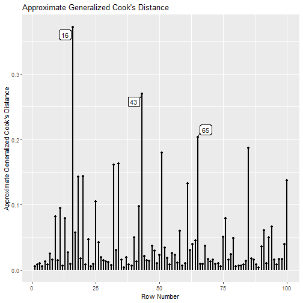

### Mahalanobis Distance


``` r
md_plot(fit_influence_approx,
        largest_md = 3)
```

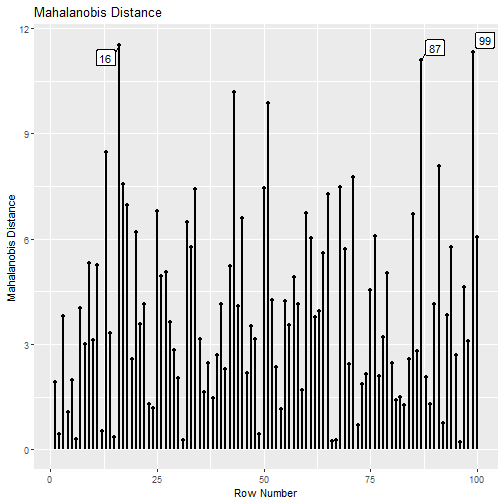

This plot is the same for both the leave-one-out approach and the
approximate approach.

### Approximate Change in Fit Measure vs. Approximate Generalized Cook's Distance


``` r
gcd_gof_plot(fit_influence_approx,
             fit_measure = "rmsea",
             largest_gcd = 3,
             largest_fit_measure = 3)
```

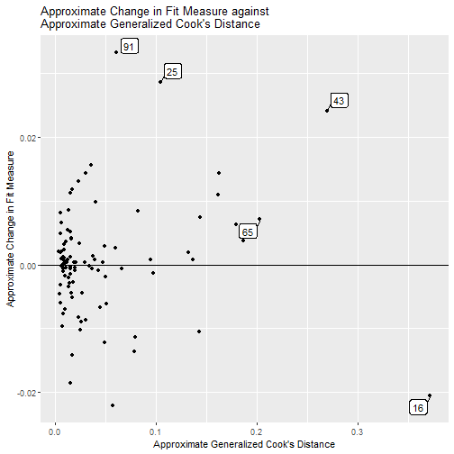

### Bubble Plot


``` r
gcd_gof_md_plot(fit_influence_approx,
                fit_measure = "rmsea",
                largest_gcd = 3,
                largest_fit_measure = 3,
                largest_md = 3,
                circle_size = 15)
```

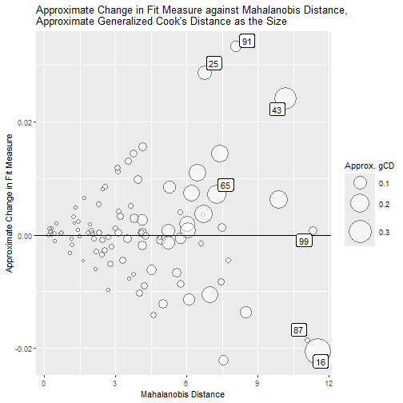

### Index Plot of Standardized or Raw Changes in Parameter Estimates


``` r
est_change_plot(fit_est_change_approx,
                largest_change = 3)
```

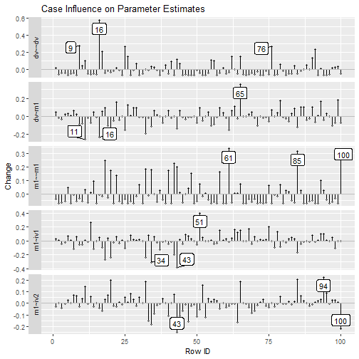


``` r
est_change_plot(fit_est_change_approx,
                parameters = "~",
                largest_change = 3)
```

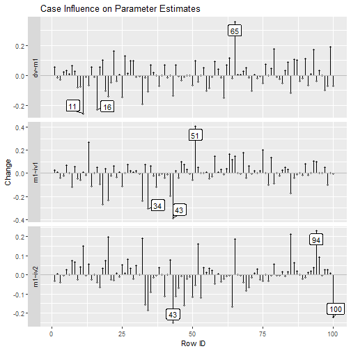


``` r
est_change_plot(fit_est_change_raw_approx,
                parameters = "~",
                largest_change = 3)
```

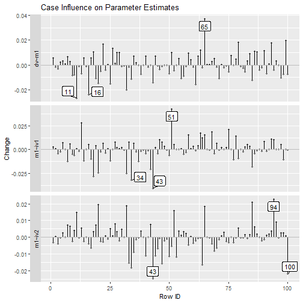

Like the leave-one-out approach, the output
of `influence_stat()` can also be used.
For example, replacing `fit_est_change_raw_approx`
by `fit_influence_approx` will generate the
same plot:


``` r
est_change_plot(fit_influence_approx,
                parameters = "~",
                largest_change = 3)
```


### Standardized Changes Against *gCD*


``` r
est_change_gcd_plot(fit_est_change_approx,
                    largest_gcd = 3)
```

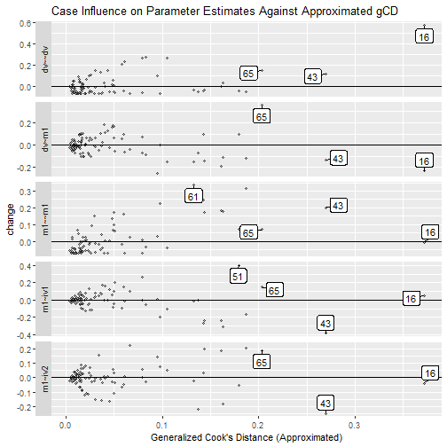

Note `largest_gcd` controls the number of cases with the
largest *approximated* *gCD* to be labelled. The default is 1.

```{ est_change_gcd_plot_approx_std_fig_2}
est_change_gcd_plot(fit_est_change_approx,
                    parameters = "~",
                    largest_gcd = 3)
```

Like the leave-one-out approach, the output
of `influence_stat()` can also be used.
For example, replacing `fit_est_change_approx`
by `fit_influence_approx` will generate the
same plot:


``` r
est_change_gcd_plot(fit_influence_approx,
                    parameters = "~",
                    largest_gcd = 3)
```

# Final Remarks

The examples above use row numbers to identify cases. If users
have meaningful case IDs, they can be used to label case (
see `vignette("user_id", package = "semfindr")`). If users want to refit the model
only with selected cases removed one-by-one,
`lavaan_rerun()` supports various methods to
examine only selected cases (see
`vignette("selecting_cases", package = "semfindr")`).

Last, all the plot functions return `ggplot` graph objects.
Users can further modify them to suit their needs. They
also have `*_aes` arguments that can be used to customize
the plot generated. Please see their help pages on how
to use these arguments.

# References

Cook, R. D. (1977). Detection of influential observation in linear regression.
*Technometrics, 19*(1), 15-18.

Fox J., & Weisberg, S. (2019). *An R companion to applied regression*
(3rd Edition). Sage.

Mahalanobis, P. C. (1936). On the generalized distance in statistics.
*Proceedings of the National Institute of Science of India*, 2, 49-55.

Pek, J., & MacCallum, R. (2011). Sensitivity analysis in structural equation
models: Cases and their influence. *Multivariate Behavioral Research, 46*(2),
202-228. https://doi.org/10.1080/00273171.2011.561068
