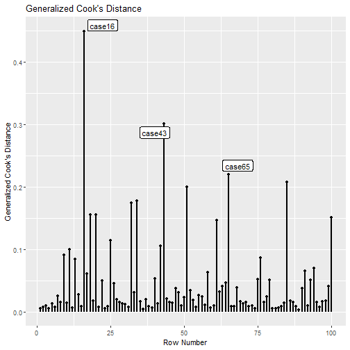
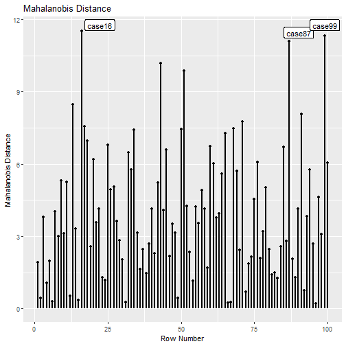
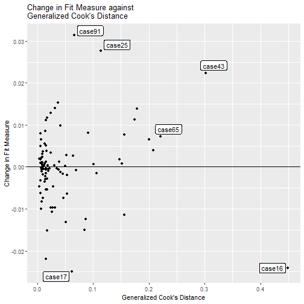
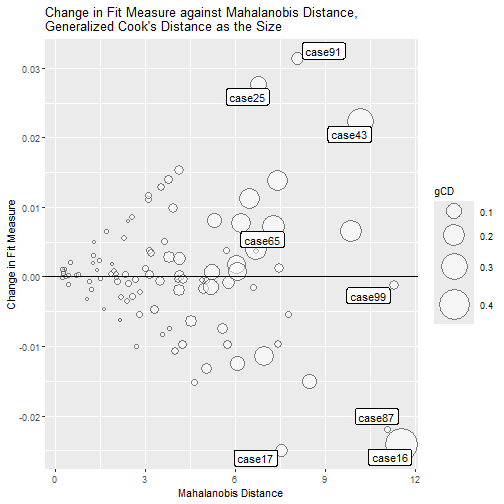

Instead of using row numbers (`case.idx` in the `lavaan` object),
`lavaan_rerun()` from the
package [semfindr](https://sfcheung.github.io/semfindr/)
[@cheung_semfindr_2026]
supports user supplied case IDs.
This can make the output more readable.


``` r
library(semfindr)
dat <- pa_dat
# Add case id
dat <- cbind(id = paste0("case", seq_len(nrow(dat))), dat)
head(dat)
#>      id          m1         dv        iv1         iv2
#> 1 case1  0.32067106  1.4587148  0.2055776 -0.42187811
#> 2 case2  0.15360231 -0.3809220  0.1853543  0.15229953
#> 3 case3  0.35136439 -0.4886773  0.9151424  1.16670950
#> 4 case4 -0.56529330 -0.9766142  0.2884440  0.04563409
#> 5 case5 -1.60657017 -1.0948066 -0.5756171 -0.18184854
#> 6 case6  0.03143301  0.5859886  0.1420111  0.06286986
```

Suppose that the data set has a column of case IDs. A model
is fitted to this data set using `lavaan::sem()`:


``` r
mod <-
"
m1 ~ iv1 + iv2
dv ~ m1
"
library(lavaan)
fit <- sem(mod, dat)
```

# Rerun *n* Times

We refit the model 100 times, each time with one case
removed. Although the `id` column is not stored in
`lavaan`, it can be supplied through the argument
`case_id`:


``` r
fit_rerun <- lavaan_rerun(fit,
                          case_id = dat$id)
#> The expected CPU time is 1.5 second(s).
#> Could be faster if run in parallel.
```

The list of reruns now uses `id` as the names:


``` r
head(fit_rerun$rerun[1:3])
#> $case1
#> lavaan 0.7-2.3166 ended normally after 2 iterations
#> 
#>   Estimator                                         ML
#>   Optimization method                           NLMINB
#>   Number of model parameters                         5
#> 
#>   Number of observations                            99
#> 
#> Model Test User Model:
#>                                                       
#>   Test statistic                                 6.557
#>   Degrees of freedom                                 2
#>   P-value (Chi-square)                           0.038
#>                                                       
#>   Browne's residual (NT model-based) test             
#>   Test statistic                                 6.345
#>   Degrees of freedom                                 2
#>   P-value (Chi-square)                           0.042
#> 
#> $case2
#> lavaan 0.7-2.3166 ended normally after 1 iteration
#> 
#>   Estimator                                         ML
#>   Optimization method                           NLMINB
#>   Number of model parameters                         5
#> 
#>   Number of observations                            99
#> 
#> Model Test User Model:
#>                                                       
#>   Test statistic                                 6.731
#>   Degrees of freedom                                 2
#>   P-value (Chi-square)                           0.035
#>                                                       
#>   Browne's residual (NT model-based) test             
#>   Test statistic                                 6.507
#>   Degrees of freedom                                 2
#>   P-value (Chi-square)                           0.039
#> 
#> $case3
#> lavaan 0.7-2.3166 ended normally after 1 iteration
#> 
#>   Estimator                                         ML
#>   Optimization method                           NLMINB
#>   Number of model parameters                         5
#> 
#>   Number of observations                            99
#> 
#> Model Test User Model:
#>                                                       
#>   Test statistic                                 7.128
#>   Degrees of freedom                                 2
#>   P-value (Chi-square)                           0.028
#>                                                       
#>   Browne's residual (NT model-based) test             
#>   Test statistic                                 6.878
#>   Degrees of freedom                                 2
#>   P-value (Chi-square)                           0.032
```

As shown below, most diagnostic functions will use user
supplied case IDs
in their displays, making it easier to locate them in the
original data set.

# Diagnostic Functions

## Standardized Changes in Estimates


``` r
fit_est_change <- est_change(fit_rerun)
fit_est_change
#> 
#> -- Standardized Case Influence on Parameter Estimates --
#> 
#>         m1~iv1 m1~iv2  dv~m1 m1~~m1 dv~~dv   gcd
#> case16   0.052 -0.038 -0.237 -0.004  0.624 0.450
#> case43  -0.403 -0.263 -0.135  0.223  0.120 0.302
#> case65   0.152  0.191  0.363  0.076  0.161 0.221
#> case85  -0.174  0.216 -0.119  0.335 -0.052 0.208
#> case51   0.421 -0.057  0.094  0.089 -0.044 0.200
#> case34  -0.314 -0.192 -0.109  0.189  0.030 0.178
#> case32  -0.247  0.195 -0.191  0.193  0.001 0.175
#> case18  -0.273  0.035  0.101  0.260 -0.046 0.156
#> case20  -0.239  0.204 -0.141  0.183 -0.032 0.156
#> case100 -0.001 -0.225 -0.069  0.305 -0.056 0.152
#> 
#> Note:
#> - Changes are standardized raw changes if a case is included.
#> - Only the first 10 case(s) is/are displayed. Set 'first' to NULL to display all cases.
#> - Cases sorted by generalized Cook's distance.
```

``` r
fit_est_change_paths_only <- est_change(fit_rerun,
                                parameters = c("m1 ~ iv1",
                                               "m1 ~ iv2",
                                               "dv ~ m1"))
fit_est_change_paths_only
#> 
#> -- Standardized Case Influence on Parameter Estimates --
#> 
#>        m1~iv1 m1~iv2  dv~m1   gcd
#> case43 -0.403 -0.263 -0.135 0.238
#> case51  0.421 -0.057  0.094 0.190
#> case65  0.152  0.191  0.363 0.189
#> case34 -0.314 -0.192 -0.109 0.142
#> case32 -0.247  0.195 -0.191 0.138
#> case20 -0.239  0.204 -0.141 0.121
#> case85 -0.174  0.216 -0.119 0.093
#> case11  0.010  0.149 -0.257 0.088
#> case18 -0.273  0.035  0.101 0.087
#> case13  0.274  0.059 -0.068 0.082
#> 
#> Note:
#> - Changes are standardized raw changes if a case is included.
#> - Only the first 10 case(s) is/are displayed. Set 'first' to NULL to display all cases.
#> - Cases sorted by generalized Cook's distance.
```

## Raw Changes in Estimates


``` r
fit_est_change_raw <- est_change_raw(fit_rerun)
fit_est_change_raw
#> 
#> -- Case Influence on Parameter Estimates --
#> 
#>        id m1~iv1      id m1~iv2     id  dv~m1      id m1~~m1     id dv~~dv
#> 1  case51  0.046  case43 -0.026 case65  0.039  case61  0.043 case16  0.108
#> 2  case43 -0.043  case94  0.024 case11 -0.027  case85  0.041  case9  0.051
#> 3  case34 -0.033 case100 -0.022 case16 -0.024 case100  0.038 case76  0.050
#> 4  case13  0.030  case85  0.021 case32 -0.021  case18  0.032 case25  0.050
#> 5  case18 -0.029  case20  0.020 case99  0.020  case42  0.029 case91  0.043
#> 6  case32 -0.026  case32  0.019 case79  0.019  case43  0.028 case17  0.039
#> 7  case20 -0.025  case65  0.019 case93  0.018  case32  0.024 case65  0.030
#> 8  case75  0.021  case34 -0.019 case22  0.017  case34  0.024 case26  0.029
#> 9  case42 -0.020  case64 -0.017 case61 -0.017  case20  0.023 case62  0.027
#> 10 case68  0.020  case52  0.016 case25 -0.015  case40  0.023 case90  0.024
#> 
#> Note:
#> - Changes are raw changes if a case is included.
#> - Only the first 10 case(s) is/are displayed. Set 'first' to NULL to display all cases.
#> - Cases sorted by the absolute changes for each variable.
```

## Mahalanobis Distance


``` r
fit_md <- mahalanobis_rerun(fit_rerun)
fit_md
#> 
#> -- Mahalanobis Distance --
#> 
#>            md
#> case16 11.530
#> case99 11.312
#> case87 11.091
#> case43 10.181
#> case51  9.869
#> case13  8.476
#> case91  8.078
#> case71  7.757
#> case17  7.555
#> case68  7.472
#> 
#> Note:
#> - Only the first 10 case(s) is/are displayed. Set 'first' to NULL to display all cases.
#> - Cases sorted by Mahalanobis distance in decreasing order.
```

## Changes in Fit Measures


``` r
fit_mc <- fit_measures_change(fit_rerun,
            fit_measures = c("chisq", "cfi", "tli", "rmsea"))
fit_mc
#> 
#> -- Case Influence on Fit Measures --
#> 
#>         chisq    cfi    tli  rmsea
#> case1   0.154 -0.002 -0.005  0.002
#> case2  -0.019  0.001  0.003 -0.001
#> case3  -0.417  0.008  0.021 -0.007
#> case4  -0.154  0.004  0.009 -0.003
#> case5   0.097  0.000  0.001  0.001
#> case6   0.116 -0.001 -0.003  0.001
#> case7  -0.631  0.014  0.034 -0.011
#> case8   0.120  0.002  0.005  0.001
#> case9   0.524 -0.012 -0.030  0.008
#> case10  0.697 -0.013 -0.033  0.011
#> 
#> Note:
#> - Only the first 10 case(s) is/are displayed. Set 'first' to NULL to display all cases.
```

## All-In-One-Function


``` r
fit_influence <- influence_stat(fit_rerun)
fit_influence
#> 
#> -- Standardized Case Influence on Parameter Estimates --
#> 
#>         m1~iv1 m1~iv2  dv~m1 m1~~m1 dv~~dv   gcd
#> case16   0.052 -0.038 -0.237 -0.004  0.624 0.450
#> case43  -0.403 -0.263 -0.135  0.223  0.120 0.302
#> case65   0.152  0.191  0.363  0.076  0.161 0.221
#> case85  -0.174  0.216 -0.119  0.335 -0.052 0.208
#> case51   0.421 -0.057  0.094  0.089 -0.044 0.200
#> case34  -0.314 -0.192 -0.109  0.189  0.030 0.178
#> case32  -0.247  0.195 -0.191  0.193  0.001 0.175
#> case18  -0.273  0.035  0.101  0.260 -0.046 0.156
#> case20  -0.239  0.204 -0.141  0.183 -0.032 0.156
#> case100 -0.001 -0.225 -0.069  0.305 -0.056 0.152
#> 
#> Note:
#> - Changes are standardized raw changes if a case is included.
#> - Only the first 10 case(s) is/are displayed. Set 'first' to NULL to display all cases.
#> - Cases sorted by generalized Cook's distance.
#> 
#> -- Case Influence on Fit Measures --
#> 
#>         chisq    cfi  rmsea    tli
#> case1   0.154 -0.002  0.002 -0.005
#> case2  -0.019  0.001 -0.001  0.003
#> case3  -0.417  0.008 -0.007  0.021
#> case4  -0.154  0.004 -0.003  0.009
#> case5   0.097  0.000  0.001  0.001
#> case6   0.116 -0.001  0.001 -0.003
#> case7  -0.631  0.014 -0.011  0.034
#> case8   0.120  0.002  0.001  0.005
#> case9   0.524 -0.012  0.008 -0.030
#> case10  0.697 -0.013  0.011 -0.033
#> 
#> Note:
#> - Only the first 10 case(s) is/are displayed. Set 'first' to NULL to display all cases.
#> 
#> -- Mahalanobis Distance --
#> 
#>            md
#> case16 11.530
#> case99 11.312
#> case87 11.091
#> case43 10.181
#> case51  9.869
#> case13  8.476
#> case91  8.078
#> case71  7.757
#> case17  7.555
#> case68  7.472
#> 
#> Note:
#> - Only the first 10 case(s) is/are displayed. Set 'first' to NULL to display all cases.
#> - Cases sorted by Mahalanobis distance in decreasing order.
```

# Diagnostic Plots

## Generalized Cook's Distance


``` r
gcd_plot(fit_influence, largest_gcd = 3)
```



## Mahalanobis Distance


``` r
md_plot(fit_influence,
        largest_md = 3)
```



## Fit Measure vs. Generalized Cook's Distance


``` r
gcd_gof_plot(fit_influence,
             fit_measure = "rmsea",
             largest_gcd = 3,
             largest_fit_measure = 3)
```



## Bubble Plot


``` r
gcd_gof_md_plot(fit_influence,
                fit_measure = "rmsea",
                largest_gcd = 3,
                largest_fit_measure = 3,
                largest_md = 3,
                circle_size = 15)
```



# References
