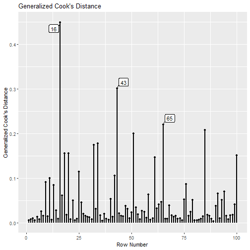

Instead of using row numbers (`case.idx` in the `lavaan` object),
`lavaan_rerun()` from the
package [semfindr](https://sfcheung.github.io/semfindr/)
supports user supplied case IDs.
This can make the output more readable.


``` r
library(semfindr)
dat <- pa_dat
# Add case id
dat <- cbind(id = paste0("case", seq_len(nrow(dat))), dat)
head(dat)
#>      id          m1         dv        iv1         iv2
#> 1 case1  0.32067106  1.4587148  0.2055776 -0.42187811
#> 2 case2  0.15360231 -0.3809220  0.1853543  0.15229953
#> 3 case3  0.35136439 -0.4886773  0.9151424  1.16670950
#> 4 case4 -0.56529330 -0.9766142  0.2884440  0.04563409
#> 5 case5 -1.60657017 -1.0948066 -0.5756171 -0.18184854
#> 6 case6  0.03143301  0.5859886  0.1420111  0.06286986
```

Suppose that the data set has a column of case IDs. A model
is fitted to this data set using `lavaan::sem()`:


``` r
mod <-
"
m1 ~ iv1 + iv2
dv ~ m1
"
library(lavaan)
fit <- sem(mod, dat)
```

# Rerun *n* Times

We refit the model 100 times, each time with one case
removed. Although the `id` column is not stored in
`lavaan`, it can be supplied through the argument
`case_id`:


``` r
fit_rerun <- lavaan_rerun(fit,
                          case_id = dat$id)
#> The expected CPU time is 1.5 second(s).
#> Could be faster if run in parallel.
#> Error: lavaan->lavData():  
#>    data= argument is not a data.frame, but of class
#> Timing stopped at: 0 0 0
```

The list of reruns now uses `id` as the names:


``` r
head(fit_rerun$rerun[1:3])
#> $`1`
#> lavaan 0.6-19 ended normally after 2 iterations
#> 
#>   Estimator                                         ML
#>   Optimization method                           NLMINB
#>   Number of model parameters                         5
#> 
#>   Number of observations                            99
#> 
#> Model Test User Model:
#>                                                       
#>   Test statistic                                 6.557
#>   Degrees of freedom                                 2
#>   P-value (Chi-square)                           0.038
#> 
#> $`2`
#> lavaan 0.6-19 ended normally after 1 iteration
#> 
#>   Estimator                                         ML
#>   Optimization method                           NLMINB
#>   Number of model parameters                         5
#> 
#>   Number of observations                            99
#> 
#> Model Test User Model:
#>                                                       
#>   Test statistic                                 6.731
#>   Degrees of freedom                                 2
#>   P-value (Chi-square)                           0.035
#> 
#> $`3`
#> lavaan 0.6-19 ended normally after 1 iteration
#> 
#>   Estimator                                         ML
#>   Optimization method                           NLMINB
#>   Number of model parameters                         5
#> 
#>   Number of observations                            99
#> 
#> Model Test User Model:
#>                                                       
#>   Test statistic                                 7.128
#>   Degrees of freedom                                 2
#>   P-value (Chi-square)                           0.028
```

As shown below, most diagnostic functions will use user
supplied case IDs
in their displays, making it easier to locate them in the
original data set.

# Diagnostic Functions

## Standardized Changes in Estimates


``` r
fit_est_change <- est_change(fit_rerun)
fit_est_change
#> 
#> -- Standardized Case Influence on Parameter Estimates --
#> 
#>     m1~iv1 m1~iv2  dv~m1 m1~~m1 dv~~dv   gcd
#> 16   0.052 -0.038 -0.237 -0.004  0.624 0.450
#> 43  -0.403 -0.263 -0.135  0.223  0.120 0.302
#> 65   0.152  0.191  0.363  0.076  0.161 0.221
#> 85  -0.174  0.216 -0.119  0.335 -0.052 0.208
#> 51   0.421 -0.057  0.094  0.089 -0.044 0.200
#> 34  -0.314 -0.192 -0.109  0.189  0.030 0.178
#> 32  -0.247  0.195 -0.191  0.193  0.001 0.175
#> 18  -0.273  0.035  0.101  0.260 -0.046 0.156
#> 20  -0.239  0.204 -0.141  0.183 -0.032 0.156
#> 100 -0.001 -0.225 -0.069  0.305 -0.056 0.152
#> 
#> Note:
#> - Changes are standardized raw changes if a case is included.
#> - Only the first 10 case(s) is/are displayed. Set 'first' to NULL to display all cases.
#> - Cases sorted by generalized Cook's distance.
```

``` r
fit_est_change_paths_only <- est_change(fit_rerun,
                                parameters = c("m1 ~ iv1",
                                               "m1 ~ iv2",
                                               "dv ~ m1"))
fit_est_change_paths_only
#> 
#> -- Standardized Case Influence on Parameter Estimates --
#> 
#>    m1~iv1 m1~iv2  dv~m1   gcd
#> 43 -0.403 -0.263 -0.135 0.238
#> 51  0.421 -0.057  0.094 0.190
#> 65  0.152  0.191  0.363 0.189
#> 34 -0.314 -0.192 -0.109 0.142
#> 32 -0.247  0.195 -0.191 0.138
#> 20 -0.239  0.204 -0.141 0.121
#> 85 -0.174  0.216 -0.119 0.093
#> 11  0.010  0.149 -0.257 0.088
#> 18 -0.273  0.035  0.101 0.087
#> 13  0.274  0.059 -0.068 0.082
#> 
#> Note:
#> - Changes are standardized raw changes if a case is included.
#> - Only the first 10 case(s) is/are displayed. Set 'first' to NULL to display all cases.
#> - Cases sorted by generalized Cook's distance.
```

## Raw Changes in Estimates


``` r
fit_est_change_raw <- est_change_raw(fit_rerun)
fit_est_change_raw
#> 
#> -- Case Influence on Parameter Estimates --
#> 
#>    id m1~iv1  id m1~iv2 id  dv~m1  id m1~~m1 id dv~~dv
#> 1  51  0.046  43 -0.026 65  0.039  61  0.043 16  0.108
#> 2  43 -0.043  94  0.024 11 -0.027  85  0.041  9  0.051
#> 3  34 -0.033 100 -0.022 16 -0.024 100  0.038 76  0.050
#> 4  13  0.030  85  0.021 32 -0.021  18  0.032 25  0.050
#> 5  18 -0.029  20  0.020 99  0.020  42  0.029 91  0.043
#> 6  32 -0.026  32  0.019 79  0.019  43  0.028 17  0.039
#> 7  20 -0.025  65  0.019 93  0.018  32  0.024 65  0.030
#> 8  75  0.021  34 -0.019 22  0.017  34  0.024 26  0.029
#> 9  42 -0.020  64 -0.017 61 -0.017  20  0.023 62  0.027
#> 10 68  0.020  52  0.016 25 -0.015  40  0.023 90  0.024
#> 
#> Note:
#> - Changes are raw changes if a case is included.
#> - Only the first 10 case(s) is/are displayed. Set 'first' to NULL to display all cases.
#> - Cases sorted by the absolute changes for each variable.
```

## Mahalanobis Distance


``` r
fit_md <- mahalanobis_rerun(fit_rerun)
fit_md
#> 
#> -- Mahalanobis Distance --
#> 
#>        md
#> 16 11.530
#> 99 11.312
#> 87 11.091
#> 43 10.181
#> 51  9.869
#> 13  8.476
#> 91  8.078
#> 71  7.757
#> 17  7.555
#> 68  7.472
#> 
#> Note:
#> - Only the first 10 case(s) is/are displayed. Set 'first' to NULL to display all cases.
#> - Cases sorted by Mahalanobis distance in decreasing order.
```

## Changes in Fit Measures


``` r
fit_mc <- fit_measures_change(fit_rerun,
            fit_measures = c("chisq", "cfi", "tli", "rmsea"))
fit_mc
#> 
#> -- Case Influence on Fit Measures --
#> 
#>     chisq    cfi    tli  rmsea
#> 1   0.154 -0.002 -0.005  0.002
#> 2  -0.019  0.001  0.003 -0.001
#> 3  -0.417  0.008  0.021 -0.007
#> 4  -0.154  0.004  0.009 -0.003
#> 5   0.097  0.000  0.001  0.001
#> 6   0.116 -0.001 -0.003  0.001
#> 7  -0.631  0.014  0.034 -0.011
#> 8   0.120  0.002  0.005  0.001
#> 9   0.524 -0.012 -0.030  0.008
#> 10  0.697 -0.013 -0.033  0.011
#> 
#> Note:
#> - Only the first 10 case(s) is/are displayed. Set 'first' to NULL to display all cases.
```

## All-In-One-Function


``` r
fit_influence <- influence_stat(fit_rerun)
fit_influence
#> 
#> -- Standardized Case Influence on Parameter Estimates --
#> 
#>     m1~iv1 m1~iv2  dv~m1 m1~~m1 dv~~dv   gcd
#> 16   0.052 -0.038 -0.237 -0.004  0.624 0.450
#> 43  -0.403 -0.263 -0.135  0.223  0.120 0.302
#> 65   0.152  0.191  0.363  0.076  0.161 0.221
#> 85  -0.174  0.216 -0.119  0.335 -0.052 0.208
#> 51   0.421 -0.057  0.094  0.089 -0.044 0.200
#> 34  -0.314 -0.192 -0.109  0.189  0.030 0.178
#> 32  -0.247  0.195 -0.191  0.193  0.001 0.175
#> 18  -0.273  0.035  0.101  0.260 -0.046 0.156
#> 20  -0.239  0.204 -0.141  0.183 -0.032 0.156
#> 100 -0.001 -0.225 -0.069  0.305 -0.056 0.152
#> 
#> Note:
#> - Changes are standardized raw changes if a case is included.
#> - Only the first 10 case(s) is/are displayed. Set 'first' to NULL to display all cases.
#> - Cases sorted by generalized Cook's distance.
#> 
#> -- Case Influence on Fit Measures --
#> 
#>     chisq    cfi  rmsea    tli
#> 1   0.154 -0.002  0.002 -0.005
#> 2  -0.019  0.001 -0.001  0.003
#> 3  -0.417  0.008 -0.007  0.021
#> 4  -0.154  0.004 -0.003  0.009
#> 5   0.097  0.000  0.001  0.001
#> 6   0.116 -0.001  0.001 -0.003
#> 7  -0.631  0.014 -0.011  0.034
#> 8   0.120  0.002  0.001  0.005
#> 9   0.524 -0.012  0.008 -0.030
#> 10  0.697 -0.013  0.011 -0.033
#> 
#> Note:
#> - Only the first 10 case(s) is/are displayed. Set 'first' to NULL to display all cases.
#> 
#> -- Mahalanobis Distance --
#> 
#>        md
#> 16 11.530
#> 99 11.312
#> 87 11.091
#> 43 10.181
#> 51  9.869
#> 13  8.476
#> 91  8.078
#> 71  7.757
#> 17  7.555
#> 68  7.472
#> 
#> Note:
#> - Only the first 10 case(s) is/are displayed. Set 'first' to NULL to display all cases.
#> - Cases sorted by Mahalanobis distance in decreasing order.
```

# Diagnostic Plots

## Generalized Cook's Distance


``` r
gcd_plot(fit_influence, largest_gcd = 3)
```



## Mahalanobis Distance


``` r
md_plot(fit_influence,
        largest_md = 3)
```


## Fit Measure vs. Generalized Cook's Distance


``` r
gcd_gof_plot(fit_influence,
             fit_measure = "rmsea",
             largest_gcd = 3,
             largest_fit_measure = 3)
```


## Bubble Plot


``` r
gcd_gof_md_plot(fit_influence,
                fit_measure = "rmsea",
                largest_gcd = 3,
                largest_fit_measure = 3,
                largest_md = 3,
                circle_size = 15)
```


